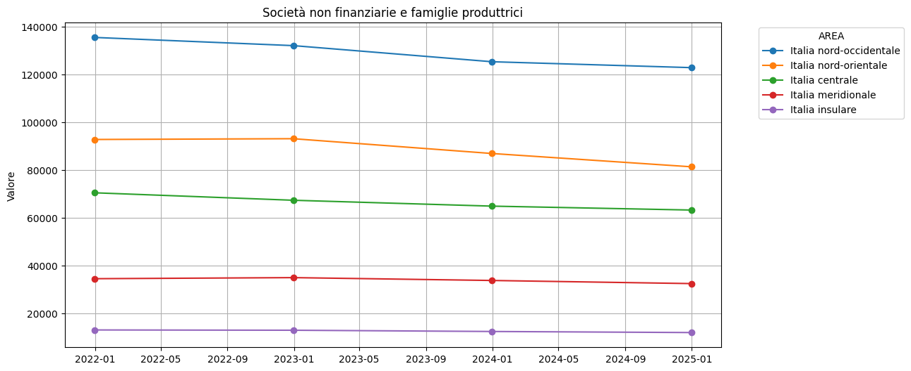
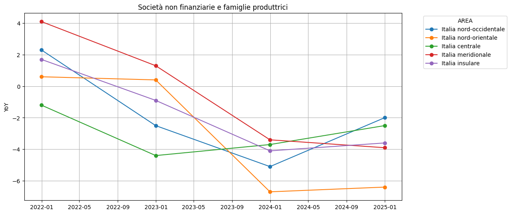

```python
import pandas as pd, os, duckdb
os.chdir('D:/')
ddb = duckdb.connect('Bankit.duckdb')
```

## analisi - collegamenti fra tabelle

### Prestiti

|prestiti||no sofference|no PCT|no sofferenze e PCT|
|-|-|-|-
||TFR20232||


```python
pd.options.display.float_format = '{:,.2f}'.format
```


```python
tabella = 'TFR20232' # regione, settore e attività economica della clientela
data = ddb.execute(f"SELECT * FROM {tabella} where DATA_OSS = '2023-12-31' order by valore desc").fetchdf()
data['VALORE'] = data['VALORE'].map(lambda x: f"{x:,.2f}")
print(data.head().to_markdown())
```

    |    |   ATECO_CTP | DATA_OSS            |   ENTE_SEGN |    FENEC | LOC_CTP   | SET_CTP   | VALORE           |   STATUS |
    |---:|------------:|:--------------------|------------:|---------:|:----------|:----------|:-----------------|---------:|
    |  0 |     1005009 | 2023-12-31 00:00:00 |     1070001 | 52000700 | IT        | SBI42     | 1,710,491,022.00 |      nan |
    |  1 |     1004999 | 2023-12-31 00:00:00 |     1070001 | 52000700 | IT        | SBI25     | 689,081,386.00   |      nan |
    |  2 |     1004999 | 2023-12-31 00:00:00 |     1070001 | 52000700 | IT        | S11       | 617,890,251.00   |      nan |
    |  3 |           0 | 2023-12-31 00:00:00 |     1070001 | 52000700 | IT        | 600       | 591,775,862.00   |      nan |
    |  4 |     1005009 | 2023-12-31 00:00:00 |     1070001 | 52000700 | ITC       | SBI42     | 563,188,778.00   |      nan |
    


```python
tabella = 'TFR20255' # area geografica e attività economica della clientela
data = ddb.execute(f"SELECT * FROM {tabella} where DATA_OSS = '2023-12-31' order by valore desc").fetchdf()
data['VALORE'] = data['VALORE'].map(lambda x: f"{x:,.2f}")
print(data.head().to_markdown())
```

    |    | ATECO_CTP   | DATA_OSS            |   ENTE_SEGN |    FENEC | LOC_CTP   | SET_CTP   | VALORE         |   STATUS |
    |---:|:------------|:--------------------|------------:|---------:|:----------|:----------|:---------------|---------:|
    |  0 | 1004999     | 2023-12-31 00:00:00 |     1070001 | 52000700 | IT        | SBI25     | 689,081,386.00 |      nan |
    |  1 | 1004999     | 2023-12-31 00:00:00 |     1070001 | 52000700 | ITC       | SBI25     | 261,532,982.00 |      nan |
    |  2 | 1004999     | 2023-12-31 00:00:00 |     1070001 | 52000700 | ITC4      | SBI25     | 199,312,935.00 |      nan |
    |  3 | C           | 2023-12-31 00:00:00 |     1070001 | 52000700 | IT        | SBI25     | 188,774,671.00 |      nan |
    |  4 | 1004999     | 2023-12-31 00:00:00 |     1070001 | 52000700 | ITH       | SBI25     | 184,656,566.00 |      nan |
    


```python
tabella = 'TFR20236' # provincia della clientela, gruppo dimensionale e sede amministrativa delle banche
data = ddb.execute(f"SELECT * FROM {tabella} where DATA_OSS = '2024-09-30'  order by valore desc").fetchdf()
data['VALORE'] = data['VALORE'].map(lambda x: f"{x:,.2f}")
print(data.head().to_markdown())
```

    |    | DATA_OSS            |   DIVISA1 |   DURORI |   ENTE_SEGN |    FENEC | LOC_CTP   | SET_CTP   | VALORE           |   STATUS |
    |---:|:--------------------|----------:|---------:|------------:|---------:|:----------|:----------|:-----------------|---------:|
    |  0 | 2024-09-30 00:00:00 |      1000 |        9 |     1070001 | 52000700 | IT        | SBI42     | 1,687,526,889.00 |      nan |
    |  1 | 2024-09-30 00:00:00 |      1000 |        9 |     5420010 | 52000700 | IT        | SBI42     | 1,644,578,812.00 |      nan |
    |  2 | 2024-09-30 00:00:00 |      1000 |        9 |     5110001 | 52000700 | IT        | SBI42     | 1,091,555,309.00 |      nan |
    |  3 | 2024-09-30 00:00:00 |      1000 |        9 |     1070001 | 52000700 | ITC       | SBI42     | 558,283,119.00   |      nan |
    |  4 | 2024-09-30 00:00:00 |      1000 |        9 |     5420010 | 52000700 | ITC       | SBI42     | 555,566,063.00   |      nan |
    


```python
tabella = 'TFR20281' # forma tecnica, area geografica e settore della clientela
data = ddb.execute(f"SELECT * FROM {tabella} where DATA_OSS = '2024-09-30' order by valore desc").fetchdf()
data['VALORE'] = data['VALORE'].map(lambda x: f"{x:,.2f}")
print(data.head().to_markdown())
```

    |    | DATA_OSS            |   DESINV |   ENTE_SEGN |    FENEC | LOC_CTP   | SET_CTP   | VALORE           |   STATUS |
    |---:|:--------------------|---------:|------------:|---------:|:----------|:----------|:-----------------|---------:|
    |  0 | 2024-09-30 00:00:00 |      997 |     1070001 | 52000700 | IT        | SBI42     | 1,687,526,889.00 |      nan |
    |  1 | 2024-09-30 00:00:00 |      997 |     1070001 |  5800526 | IT        | SBI42     | 945,644,166.00   |      nan |
    |  2 | 2024-09-30 00:00:00 |      997 |     1070001 | 52000700 | IT        | SBI25     | 667,069,866.00   |      nan |
    |  3 | 2024-09-30 00:00:00 |      997 |     1070001 | 52000700 | IT        | S11       | 599,431,427.00   |      nan |
    |  4 | 2024-09-30 00:00:00 |      997 |     1070001 | 52000700 | IT        | 600       | 590,527,781.00   |      nan |
    

### Prestiti escluse sofferenze


```python
tabella = 'TDB20226' # forma tecnica, area geografica e settore della clientela
data = ddb.execute(f"SELECT * FROM {tabella} where DATA_OSS = '2024-09-30' order by valore desc").fetchdf()
data['VALORE'] = data['VALORE'].map(lambda x: f"{x:,.2f}")
print(data.head().to_markdown())
```

    |    | DATA_OSS            |   ENTE_SEGN |    FENEC | LOC_CTP   | SET_CTP   | VALORE           |   STATUS |
    |---:|:--------------------|------------:|---------:|:----------|:----------|:-----------------|---------:|
    |  0 | 2024-09-30 00:00:00 |     1070001 | 52000138 | IT        | SBI42     | 1,657,046,646.00 |      nan |
    |  1 | 2024-09-30 00:00:00 |     1070001 | 52000138 | IT        | SBI25     | 646,264,378.00   |      nan |
    |  2 | 2024-09-30 00:00:00 |     1070001 | 52000138 | IT        | 600       | 581,931,586.00   |      nan |
    |  3 | 2024-09-30 00:00:00 |     1070001 | 52000138 | ITC       | SBI42     | 550,120,751.00   |      nan |
    |  4 | 2024-09-30 00:00:00 |     1070001 | 52000138 | IT        | S11BI13   | 545,103,486.00   |      nan |
    

### Prestiti (esclusi PCT)


```python
tabella = 'TFR10194' # Prestiti (esclusi PCT), Depositi (esclusi PCT) e Sportelli
data = ddb.execute(f"SELECT * FROM {tabella}  where DATA_OSS = '2023-12-31'order by valore desc").fetchdf()
data['VALORE'] = data['VALORE'].map(lambda x: f"{x:,.2f}")
print(data.head().to_markdown())
```

    |    | DATA_OSS            |   DIVISA1 |   DURORI |   ENTE_SEGN |   FENEC |   LOC_SPORT | PRV_SPORT   | RESIDENZA1   | VALORE           |   STATUS |
    |---:|:--------------------|----------:|---------:|------------:|--------:|------------:|:------------|:-------------|:-----------------|---------:|
    |  0 | 2023-12-31 00:00:00 |      1000 |        9 |     1100010 | 1041810 |     9999997 | IT          | IT           | 1,546,906,651.00 |      nan |
    |  1 | 2023-12-31 00:00:00 |      1000 |        9 |     1100010 | 1077778 |     9999997 | IT          | IT           | 1,429,501,870.00 |      nan |
    |  2 | 2023-12-31 00:00:00 |      1000 |        9 |     1100010 | 1077778 |     9999997 | ITC4        | IT           | 532,833,250.00   |      nan |
    |  3 | 2023-12-31 00:00:00 |      1000 |        9 |     1100010 | 1041810 |     9999997 | ITC4        | IT           | 498,031,476.00   |      nan |
    |  4 | 2023-12-31 00:00:00 |      1000 |        9 |     1100010 | 1077778 |     9999997 | ITC4C       | IT           | 396,847,764.00   |      nan |
    


```python
tabella = 'TFR10241' # Prestiti (esclusi PCT) per provincia dello sportello e settore della clientela
data = ddb.execute(f"SELECT * FROM {tabella}  where DATA_OSS = '2023-12-31'order by valore desc").fetchdf()
data['VALORE'] = data['VALORE'].map(lambda x: f"{x:,.2f}")
print(data.head().to_markdown())
```

    |    | DATA_OSS            |   DURORI |   ENTE_SEGN |   FENEC | LOC_SPORT   | RESIDENZA1   | SET_CTP   | VALORE           |   STATUS |
    |---:|:--------------------|---------:|------------:|--------:|:------------|:-------------|:----------|:-----------------|---------:|
    |  0 | 2023-12-31 00:00:00 |        9 |     1100010 | 1077778 | IT          | IT           | SBI42     | 1,427,167,662.00 |      nan |
    |  1 | 2023-12-31 00:00:00 |        9 |     1100010 | 1077778 | ITC         | IT           | SBI42     | 696,234,350.00   |      nan |
    |  2 | 2023-12-31 00:00:00 |        9 |     1100010 | 1077778 | IT          | IT           | S11       | 595,728,944.00   |      nan |
    |  3 | 2023-12-31 00:00:00 |        9 |     1100010 | 1077778 | IT          | IT           | SBI28     | 595,518,826.00   |      nan |
    |  4 | 2023-12-31 00:00:00 |        9 |     1100010 | 1077778 | ITC4        | IT           | SBI42     | 531,294,788.00   |      nan |
    


```python
tabella = 'TFR10286' # Prestiti (esclusi PCT) e numero di rapporti per provincia dello sportello
data = ddb.execute(f"SELECT * FROM {tabella}  where DATA_OSS = '2023-12-31'order by valore desc").fetchdf()
data['VALORE'] = data['VALORE'].map(lambda x: f"{x:,.2f}")
print(data.head().to_markdown())
```

    |    | DATA_OSS            |   ENTE_SEGN |   FENEC | LOC_SPORT   | VALORE           |   STATUS |
    |---:|:--------------------|------------:|--------:|:------------|:-----------------|---------:|
    |  0 | 2023-12-31 00:00:00 |     1100010 | 1077778 | IT          | 1,485,058,678.00 |      nan |
    |  1 | 2023-12-31 00:00:00 |     1100010 | 1077778 | ITC         | 745,568,825.00   |      nan |
    |  2 | 2023-12-31 00:00:00 |     1100010 | 1077778 | ITC4        | 569,027,506.00   |      nan |
    |  3 | 2023-12-31 00:00:00 |     1100010 | 1077778 | ITC4C       | 432,249,457.00   |      nan |
    |  4 | 2023-12-31 00:00:00 |     1100010 | 1077778 | ITH         | 294,683,792.00   |      nan |
    


```python
tabella = 'TFR10232' # Prestiti (esclusi PCT) per provincia, settore e attività economica della clientela
data = ddb.execute(f"SELECT * FROM {tabella}  where DATA_OSS = '2023-12-31'order by valore desc").fetchdf()
data['VALORE'] = data['VALORE'].map(lambda x: f"{x:,.2f}")
print(data.head().to_markdown())
```

    |    |   ATECO_CTP | DATA_OSS            |   ENTE_SEGN |   FENEC | LOC_CTP   | SET_CTP   | VALORE           |   STATUS |
    |---:|------------:|:--------------------|------------:|--------:|:----------|:----------|:-----------------|---------:|
    |  0 |     1005009 | 2023-12-31 00:00:00 |     1070001 | 1077778 | IT        | SBI42     | 1,671,780,557.00 |      nan |
    |  1 |     1004999 | 2023-12-31 00:00:00 |     1070001 | 1077778 | IT        | S11       | 613,650,284.00   |      nan |
    |  2 |           0 | 2023-12-31 00:00:00 |     1070001 | 1077778 | IT        | SBI28     | 599,107,152.00   |      nan |
    |  3 |     1005009 | 2023-12-31 00:00:00 |     1070001 | 1077778 | ITC       | SBI42     | 562,396,271.00   |      nan |
    |  4 |     1005009 | 2023-12-31 00:00:00 |     1070001 | 1077778 | ITI       | SBI42     | 502,699,340.00   |      nan |
    


```python

```

## analisi


```python
tabella = 'V_TDB10224_stafinra'
data = ddb.execute(f"SELECT * FROM {tabella}").fetchdf()
```


```python
data['SEGNALANTE'].unique()
```


    array(['Banche e Cassa depositi e prestiti', 'Banche'], dtype=object)


- SBI25 Società non finanziarie e famiglie produttrici
- SBI33	Società di persone, semplici, di fatto e ditte
- 1100010	Banche
- 1070001	Banche e Cassa depositi e prestiti	


```python
data.sample(3)
```


<div>
<style scoped>
    .dataframe tbody tr th:only-of-type {
        vertical-align: middle;
    }

    .dataframe tbody tr th {
        vertical-align: top;
    }

    .dataframe thead th {
        text-align: right;
    }
</style>
<table border="1" class="dataframe">
  <thead>
    <tr style="text-align: right;">
      <th></th>
      <th>DATA_OSS</th>
      <th>ENTE_SEGN</th>
      <th>SEGNALANTE</th>
      <th>LOC_CTP</th>
      <th>AREA</th>
      <th>SET_CTP</th>
      <th>TARGET</th>
      <th>FENEC</th>
      <th>FENOMENO</th>
      <th>VALORE</th>
      <th>STATUS</th>
    </tr>
  </thead>
  <tbody>
    <tr>
      <th>88886</th>
      <td>2013-11-30</td>
      <td>1070001</td>
      <td>Banche e Cassa depositi e prestiti</td>
      <td>ITF12</td>
      <td>Teramo</td>
      <td>SBI25</td>
      <td>Società non finanziarie e famiglie produttrici</td>
      <td>52000139</td>
      <td>None</td>
      <td>1222169.0</td>
      <td>NaN</td>
    </tr>
    <tr>
      <th>9333</th>
      <td>2023-10-31</td>
      <td>1070001</td>
      <td>Banche e Cassa depositi e prestiti</td>
      <td>ITH34</td>
      <td>Treviso</td>
      <td>SBI25</td>
      <td>Società non finanziarie e famiglie produttrici</td>
      <td>52000139</td>
      <td>None</td>
      <td>15109604.0</td>
      <td>NaN</td>
    </tr>
    <tr>
      <th>60525</th>
      <td>2017-05-31</td>
      <td>1070001</td>
      <td>Banche e Cassa depositi e prestiti</td>
      <td>ITF1</td>
      <td>Abruzzo</td>
      <td>SBI25</td>
      <td>Società non finanziarie e famiglie produttrici</td>
      <td>52000139</td>
      <td>None</td>
      <td>10778044.0</td>
      <td>NaN</td>
    </tr>
  </tbody>
</table>
</div>


```python
abr = ['ITF11', 'ITF12', 'ITF13', 'ITF14', 'ITF1']
mol = ['ITF22', 'ITF21',  'ITF2']
cam = ['ITF31', 'ITF32', 'ITF33', 'ITF34', 'ITF35', 'ITF3']
pug = ['ITF31', 'ITF32', 'ITF33', 'ITF34', 'ITF35', 'ITF3']
bas = ['ITF51', 'ITF52', 'ITF5']
cal = ['ITF65','ITF63','ITF61', 'ITF62', 'ITF64', 'ITF6']
sic = ['ITG11', 'ITG12', 'ITG13', 'ITG14', 'ITG15', 'ITG16', 'ITG17', 'ITG18', 'ITG19', 'ITG1']
sar = ['ITG21', 'ITG22', 'ITG23', 'ITG24', 'ITG2']
reg = ['ITF1', 'ITF2', 'ITF3', 'ITF4', 'ITF5', 'ITF6', 'ITG1', 'ITG2']
ita = ['ITC', 'ITH','ITI','ITF', 'ITG', 'ITD']
```


```python
cluster = ita

df_filtrato = data[
    (data["LOC_CTP"].isin(cluster)) &  # 🔹 Usa il cluster corretto
    (data["DATA_OSS"].isin([pd.Timestamp("2020-12-31"), pd.Timestamp("2021-12-31"), pd.Timestamp("2022-12-31"),
                            pd.Timestamp("2023-12-31"), pd.Timestamp("2024-12-31")])) & 
    (data["ENTE_SEGN"] == "1070001") &  
    (data["SET_CTP"] == "SBI25")  
]

df_filtrato.loc[:, "VALORE"] = (df_filtrato["VALORE"] / 1000).astype(int)
df_filtrato.loc[:, "LOC_CTP"] = pd.Categorical(df_filtrato["LOC_CTP"], categories=cluster, ordered=True)

pivot_df = pd.pivot_table(df_filtrato, index="AREA", columns=["TARGET", "DATA_OSS"], values="VALORE")
area_order = df_filtrato.drop_duplicates("AREA")[["AREA", "LOC_CTP"]].set_index("AREA")["LOC_CTP"]
ordered_areas = area_order[area_order.isin(cluster)].sort_values(
    key=lambda x: x.map({v: i for i, v in enumerate(cluster)})
).index
pivot_df = pivot_df.loc[ordered_areas]
A = pivot_df.iloc[:, 1:].astype(int)

pivot_df_yoy = pivot_df.pct_change(axis=1) * 100
pivot_df_yoy = pivot_df_yoy.iloc[:, 1:]
B = pivot_df_yoy.round(1)

pd.concat([A, B], axis=1)
```


<div>
<style scoped>
    .dataframe tbody tr th:only-of-type {
        vertical-align: middle;
    }

    .dataframe tbody tr th {
        vertical-align: top;
    }

    .dataframe thead tr th {
        text-align: left;
    }

    .dataframe thead tr:last-of-type th {
        text-align: right;
    }
</style>
<table border="1" class="dataframe">
  <thead>
    <tr>
      <th>TARGET</th>
      <th colspan="8" halign="left">Società non finanziarie e famiglie produttrici</th>
    </tr>
    <tr>
      <th>DATA_OSS</th>
      <th>2021-12-31</th>
      <th>2022-12-31</th>
      <th>2023-12-31</th>
      <th>2024-12-31</th>
      <th>2021-12-31</th>
      <th>2022-12-31</th>
      <th>2023-12-31</th>
      <th>2024-12-31</th>
    </tr>
    <tr>
      <th>AREA</th>
      <th></th>
      <th></th>
      <th></th>
      <th></th>
      <th></th>
      <th></th>
      <th></th>
      <th></th>
    </tr>
  </thead>
  <tbody>
    <tr>
      <th>Italia nord-occidentale</th>
      <td>135368</td>
      <td>131943</td>
      <td>125201</td>
      <td>122737</td>
      <td>2.3</td>
      <td>-2.5</td>
      <td>-5.1</td>
      <td>-2.0</td>
    </tr>
    <tr>
      <th>Italia nord-orientale</th>
      <td>92674</td>
      <td>93000</td>
      <td>86807</td>
      <td>81247</td>
      <td>0.6</td>
      <td>0.4</td>
      <td>-6.7</td>
      <td>-6.4</td>
    </tr>
    <tr>
      <th>Italia centrale</th>
      <td>70368</td>
      <td>67244</td>
      <td>64786</td>
      <td>63149</td>
      <td>-1.2</td>
      <td>-4.4</td>
      <td>-3.7</td>
      <td>-2.5</td>
    </tr>
    <tr>
      <th>Italia meridionale</th>
      <td>34425</td>
      <td>34876</td>
      <td>33683</td>
      <td>32382</td>
      <td>4.1</td>
      <td>1.3</td>
      <td>-3.4</td>
      <td>-3.9</td>
    </tr>
    <tr>
      <th>Italia insulare</th>
      <td>12981</td>
      <td>12864</td>
      <td>12341</td>
      <td>11895</td>
      <td>1.7</td>
      <td>-0.9</td>
      <td>-4.1</td>
      <td>-3.6</td>
    </tr>
  </tbody>
</table>
</div>


```python
A
```


<div>
<style scoped>
    .dataframe tbody tr th:only-of-type {
        vertical-align: middle;
    }

    .dataframe tbody tr th {
        vertical-align: top;
    }

    .dataframe thead tr th {
        text-align: left;
    }

    .dataframe thead tr:last-of-type th {
        text-align: right;
    }
</style>
<table border="1" class="dataframe">
  <thead>
    <tr>
      <th>TARGET</th>
      <th colspan="4" halign="left">Società non finanziarie e famiglie produttrici</th>
    </tr>
    <tr>
      <th>DATA_OSS</th>
      <th>2021-12-31</th>
      <th>2022-12-31</th>
      <th>2023-12-31</th>
      <th>2024-12-31</th>
    </tr>
    <tr>
      <th>AREA</th>
      <th></th>
      <th></th>
      <th></th>
      <th></th>
    </tr>
  </thead>
  <tbody>
    <tr>
      <th>Italia nord-occidentale</th>
      <td>135368</td>
      <td>131943</td>
      <td>125201</td>
      <td>122737</td>
    </tr>
    <tr>
      <th>Italia nord-orientale</th>
      <td>92674</td>
      <td>93000</td>
      <td>86807</td>
      <td>81247</td>
    </tr>
    <tr>
      <th>Italia centrale</th>
      <td>70368</td>
      <td>67244</td>
      <td>64786</td>
      <td>63149</td>
    </tr>
    <tr>
      <th>Italia meridionale</th>
      <td>34425</td>
      <td>34876</td>
      <td>33683</td>
      <td>32382</td>
    </tr>
    <tr>
      <th>Italia insulare</th>
      <td>12981</td>
      <td>12864</td>
      <td>12341</td>
      <td>11895</td>
    </tr>
  </tbody>
</table>
</div>


```python
import matplotlib.pyplot as plt

# Verifica che A sia definito
if 'A' in locals():
    # Assicurarsi che i dati siano numerici
    A = A.apply(pd.to_numeric)

    # Convertire le colonne in un livello semplice se sono un MultiIndex
    x_labels = A.columns.get_level_values(-1) if isinstance(A.columns, pd.MultiIndex) else A.columns

    # Creare il grafico lineare (lineplot)
    plt.figure(figsize=(12, 6))

    # Iterare sulle righe di A per tracciare le linee, usando solo i valori del DataFrame
    for index, row in A.iterrows():
        plt.plot(x_labels, row.values, marker='o', label=index)

    # Impostare il titolo con il nome della colonna TARGET se disponibile
    target_name = A.columns.get_level_values(0)[0] if isinstance(A.columns, pd.MultiIndex) else "Valori"
    plt.title(f"{target_name}")

    # Personalizzazione del grafico
    # plt.xlabel("Anno")
    plt.ylabel("Valore")
    plt.legend(title="AREA", bbox_to_anchor=(1.05, 1), loc='upper left')
    plt.grid(True)
    # plt.xticks(rotation=45)

    # Mostrare il grafico
    plt.show()
else:
    print("❌ La variabile A non è definita. Assicurati di eseguire prima il codice che la genera.")


```


    

    


```python
import matplotlib.pyplot as plt

# Verifica che B sia definito
if 'B' in locals():
    # Assicurarsi che i dati siano numerici
    B = B.apply(pd.to_numeric)

    # Convertire le colonne in un livello semplice se sono un MultiIndex
    x_labels = B.columns.get_level_values(-1) if isinstance(B.columns, pd.MultiIndex) else B.columns

    # Creare il grafico lineare (lineplot)
    plt.figure(figsize=(12, 6))

    # Iterare sulle righe di B per tracciare le linee, usando solo i valori del DataFrame
    for index, row in B.iterrows():
        plt.plot(x_labels, row.values, marker='o', label=index)

    # Impostare il titolo con il nome della colonna TARGET se disponibile
    target_name = A.columns.get_level_values(0)[0] if isinstance(A.columns, pd.MultiIndex) else "Valori"
    plt.title(f"{target_name}")

    # Personalizzazione del grafico
    # plt.xlabel("Anno")
    plt.ylabel("YoY")
    plt.legend(title="AREA", bbox_to_anchor=(1.05, 1), loc='upper left')
    plt.grid(True)
    # plt.xticks(rotation=45)

    # Mostrare il grafico
    plt.show()
else:
    print("❌ La variabile B non è definita. Assicurati di eseguire prima il codice che la genera.")


```


    

    


```python

```


```python
import pygwalker as pyg
walker = pyg.walk(data)
```


    Box(children=(HTML(value='\n<div id="ifr-pyg-000630ce187537cfw1p7zUxPJjdZrDof" style="height: auto">\n    <hea…


<script>
    window.addEventListener("message", function(event) {
        const backgroundMap = {
            "dark": "hsl(240 10% 3.9%)",
            "light": "hsl(0 0 100%)",
        };
        const colorMap = {
            "dark": "hsl(0 0% 98%)",
            "light": "hsl(240 10% 3.9%)",
        };
        if (event.data.action === "changeAppearance" && event.data.gid === "000630ce187537cfw1p7zUxPJjdZrDof") {
            var iframe = document.getElementById("gwalker-000630ce187537cfw1p7zUxPJjdZrDof");
            iframe.style.background  = backgroundMap[event.data.appearance];
            iframe.style.color = colorMap[event.data.appearance];
        }
    });
</script>


```python

```
