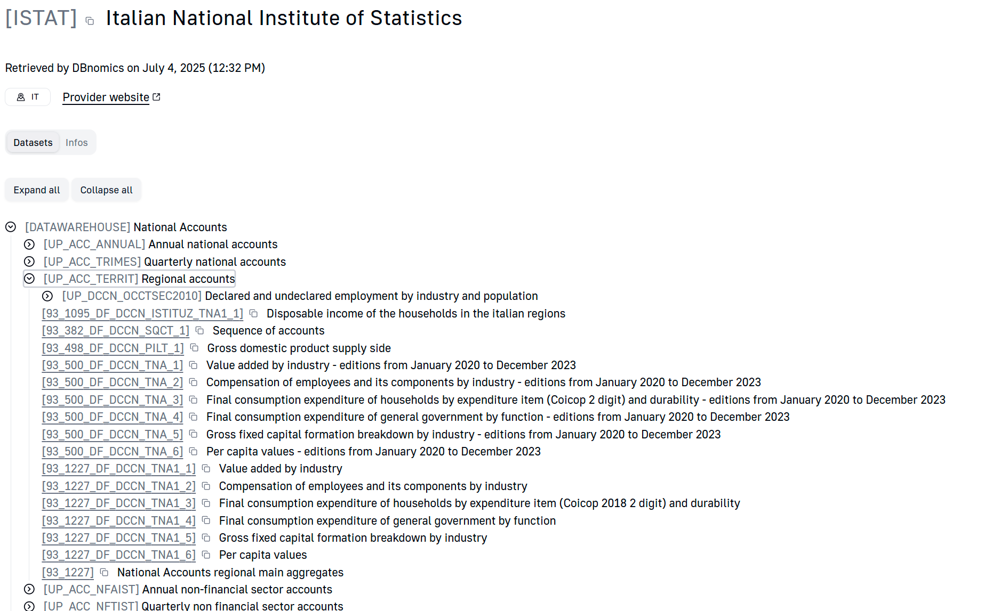

# [ISTAT](https://db.nomics.world/ISTAT)  Italian National Institute of Statistics
Retrieved by DBnomics on July 4, 2025 (12:32 PM)

- [DATAWAREHOUSE] National Accounts
- [HOU] Households Economic Conditions and Disparities
- [POP] Population and Households
- [SEP] Single Exit Point
- [Z0800SSW] Social Security and Welfare
- [Z0900ENT] Enterprises
- [Z1000AGR] Agriculture
- [Z0820EDU] Education and training
- [Z0400PRI] Prices
- [Z0840JUS] Justice and Security
- [Z0910PUB] Public Administrations and Private Institutions
- [Z0850DAI] Daily life and citizen opinions
- [Z0600IND] Industry and Construction
- [Z0700SER] Services
- [Z0920ENV] Environment and Energy
- [Z0830COM] Communication, culture, trips
- [Z0500LAB] Labour and wages
- [Z0810HEA] Health statistics
- [Z0930TER] Territorial features
- [Z1100AGR] Agricultural Census 2020
- [Z1200PUB] Public Administration
- [ZZ_​FOCUS] FOCUS
- [Z1200CPA] Permanent census of population and housing
- [SDDS_​PLUS_​IT] SDDS Plus Indicators