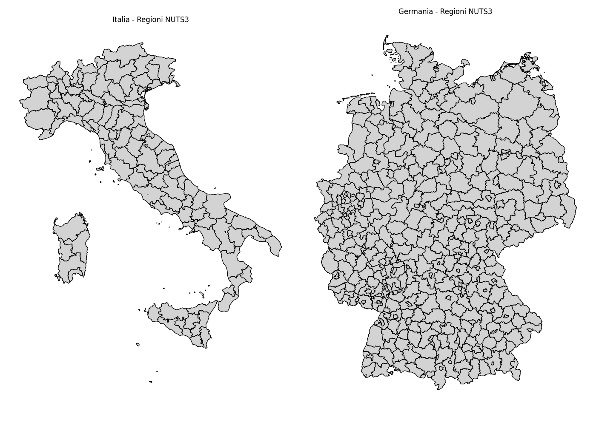

# Germania (DE) VS Italia (IT)

### tabella comparativa tra, basata su dati recenti:

| Indicatore                    | Germania (DE)                                                                                                                                                                                              | Italia (IT)                                                                             |
| --------------------------------- | -------------------------------------------------------------------------------------------------------------------------------------------------------------------------------------------------------------- | ------------------------------------------------------------------------------------------- |
| Popolazione                   | ~ 83,6 M (fine 2024) ([ec.europa.eu](https://ec.europa.eu/eurostat/web/interactive-publications/regions-2024?utm_source=chatgpt.com "Regions in Europe – 2024 edition - Interactive publications - Eurostat")) | ~ 58,9 M (2025)                                                                             |
| PIL nominale totale           | €4 745 mld (2025e)                                                                                                                                                                                             | €2 460 mld (2025e)                                                                          |
| PIL pro capite (nominale)     | €55 900 (2024)                                                                                                                                                                                                 | €41 710 (2025)                                                                              |
| Reddito medio (salario lordo) | €5 274/mese (2024)                                                                                                                                                                                             | €2 968/mese (2024)                                                                          |
| Valore aggiunto (media NUTS2) | ~€38 700–€64 800 procapite (regioni) Media stimata ~€45 000                                                                                                                                                    | ~€31 600–€34 600 procapite nelle regioni principali (Lazio, Emilia‑Romagna), media ~€32 000 |

 fonte: [en.wikipedia.org](https://en.wikipedia.org/wiki/List_of_NUTS_regions_in_the_European_Union_by_GDP?utm_source=chatgpt.com "List of NUTS regions in the European Union by GDP")

### Interpretazione

- Popolazione: la Germania conta circa 25 M di abitanti in più rispetto all’Italia.
    
- PIL totale: quasi il doppio (€4,7 T vs €2,46 T).
    
- PIL pro capite: in Germania è circa +34% superiore.
    
- Salario lordo medio: in Germania è quasi il 77% più alto di quello italiano.
    
- Valore aggiunto pro capite regionale: le regioni tedesche generano mediamente tra €38–65k, mentre in Italia si attestano intorno a €30–35k, con una media stimata intorno ai €32 k contro i €45 k tedeschi.
    
