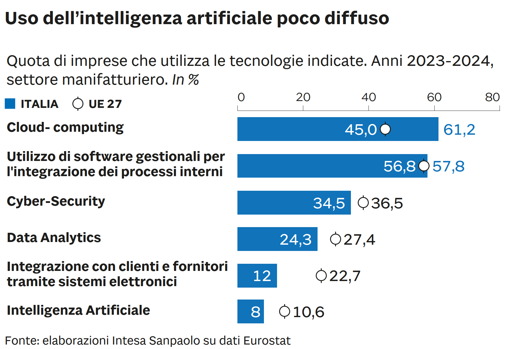

# [ISOC](https://ec.europa.eu/eurostat/web/digital-economy-and-society/database)

https://github.com/paolovolterra/test/blob/main/Eurostat/ISOC.md

Il dataset Eurostat "**isoc**" è una famiglia di dataset che raccoglie statistiche ufficiali su tecnologie dell'informazione e della comunicazione (ICT) nei seguenti ambiti:

**ISOC = _Information Society Statistics_**

Il dataset ISOC è molto utile per:

- monitorare l'evoluzione digitale nei diversi paesi UE
    
- costruire indicatori di [[../../Istat/MD/Competitività]] e [[innovazione]]
    
- analizzare divari territoriali o generazionali nella [[digitalizzazione]]
    
- valutare l’impatto di policy digitali (es. PNRR, Digitale 2026, AI Act)
- 
La famiglia `isoc` include diversi sottodataset organizzati per ambito:

|Sottodominio|Ambito|
|---|---|
|`isoc_cii`|ICT nelle imprese (uso di internet, cloud, AI, sicurezza, e-commerce)|
|`isoc_pi`|ICT nelle famiglie e individui (accesso a internet, competenze digitali, servizi online)|
|`isoc_r`|Accesso e connettività (banda larga, 5G, infrastrutture digitali)|
|`isoc_ec`|E-commerce|
|`isoc_ebi`|Barriere all’adozione ICT nelle imprese|
|`isoc_sk`|Competenze digitali e formazione|
|`isoc_ci_ai`|Adozione di Intelligenza Artificiale|
|`isoc_ci_cfw`|Lavoro da remoto e flessibile|

##  Esempi di dataset specifici

|Codice|Descrizione sintetica|
|---|---|
|`isoc_cii_iu`|Accesso e uso di internet nelle imprese|
|`isoc_cicce_use`|Uso del cloud computing nelle imprese|
|`isoc_ci_ai_use`|Utilizzo di tecnologie AI nelle imprese|
|`isoc_pi_ac_i`|Accesso a internet da parte delle famiglie|
|`isoc_sk_dskl_i`|Competenze digitali degli individui|
|`isoc_ciegi_use`|Uso dell'e-government da parte delle imprese|

## Variabili comuni

I dataset ISOC includono solitamente le seguenti dimensioni:

- GEO: paese o regione (es. IT, DE, EU27)
    
- TIME: anno (2005 – oggi)
    
- SIZECLASS: dimensione d’impresa
    
- NACE_R2: settore economico (per imprese)
    
- IND_TYPE: tipo di indicatore (valore assoluto, percentuale)
    
- UNIT: percentuale, numero di imprese/individui
    
- INDIC_IS: codice dell’indicatore (es. uso cloud, AI, big data)
    
- AGE / SEX / EDU: per dati su individui
    

# Un esempio

## isoc_eb_das - Analisi dei dati per classe dimensionale dell'impresa

- https://ec.europa.eu/eurostat/api/dissemination/statistics/1.0/data/isoc_eb_das?geo=IT
- id: "frequenza","size_emp","nace_r2","indic_is","unità","geo","tempo"
### freq

- "A": "Annuale"
### size_emp

- "0_1": "Da 0 a 1 persona occupata",
- "0-9": "Da 0 a 9 persone impiegate",
- "2-9": "Da 2 a 9 persone impiegate",
- "10-49": "Da 10 a 49 persone impiegate",
- "10-249": "Da 10 a 249 persone impiegate",
- "GE10": "10 o più persone occupate",
- "50-249": "Da 50 a 249 persone impiegate",
- "GE250": "250 persone occupate o più"
### nace_r2

- "C10-S951_X_K": "Tutte le attività (eccetto agricoltura, silvicoltura e pesca, nonché estrazione mineraria e cave), escluso il settore finanziario"

### indic_is
- "E_DAOWN": "Aziende in cui l'analisi dei dati per l'azienda viene eseguita dai propri dipendenti",
- "E_DASERP": "Le aziende eseguono analisi dei dati sui dati provenienti da registri delle transazioni, come dettagli di vendita, registri dei pagamenti",
- "E_DASCRM": "Le aziende eseguono analisi dei dati sui dati dei clienti, ad esempio informazioni sugli acquisti, posizione, preferenze, recensioni dei clienti, ricerche",
- "E_DASSM": "Le aziende eseguono analisi dei dati sui dati provenienti dai social media, compresi i profili social aziendali stessi",
- "E_DASWEB": "Le aziende eseguono analisi dei dati sui dati web",
- "E_DASLOC": "Le aziende eseguono analisi dei dati sulla posizione tramite l'uso di dispositivi portatili o veicoli",
- "E_DASSDS": "Le aziende eseguono analisi dei dati su dati provenienti da dispositivi intelligenti o sensori",
- "E_DASGOV": "Le imprese eseguono analisi dei dati sui dati aperti delle autorità governative",
- "E_DASSAT": "Le aziende eseguono analisi dei dati sui dati satellitari",
- "E_DASANY": "Le aziende eseguono analisi dei dati su dati provenienti da qualsiasi fonte",
- "E_DASGE3": "Le aziende eseguono analisi dei dati su dati provenienti da almeno tre fonti",
- "E_DASANY2": "Le aziende eseguono analisi dei dati su dati provenienti da qualsiasi fonte tra E_DASWEB, E_DASLOC, E_DASSDS, E_DASGOV e E_DASSAT",
- "E_DASANY_ADS": "Le aziende eseguono analisi dei dati su dati provenienti da qualsiasi fonte e pagano per fare pubblicità su Internet",
- "E_DAEXT": "Aziende in cui l'analisi dei dati per l'azienda viene eseguita da un'azienda o un'organizzazione esterna",
- "E_DA": "L'analisi dei dati per l'azienda viene eseguita dai dipendenti dell'azienda stessa o da un fornitore esterno",
- "E_DSELL": "Le aziende vendono (l'accesso a) tutti i propri dati",
- "E_DSELLX": "Le aziende non vendono (l'accesso a) nessuno dei propri dati",
- "E_DASSDS_SELL": "Le aziende eseguono analisi dei dati provenienti da dispositivi intelligenti o sensori e vendono (l'accesso ai) propri dati",
- "E_DASLOC_SELL": "Le aziende eseguono analisi dei dati sulla posizione geografica derivanti dall'uso di dispositivi portatili e vendono (l'accesso ai) propri dati",
- "E_DASSM_SELL": "Le aziende eseguono analisi dei dati sui dati provenienti dai social media e vendono (l'accesso ai) propri dati",
- "E_DASWEB_SELL": "Le aziende eseguono analisi dei dati sui dati web e vendono (l'accesso ai) propri dati",
- "E_DBUY": "Le aziende hanno acquistato (accesso a) qualsiasi dato",
- "E_DASSDS_BUY": "Le aziende eseguono analisi dei dati su dati provenienti da dispositivi intelligenti o sensori e acquistano (accesso a) qualsiasi dato",
- "E_DASLOC_BUY": "Le aziende eseguono analisi dei dati sulla posizione geografica derivanti dall'uso di dispositivi portatili e acquistano (accesso a) qualsiasi dato",
- "E_DASSM_BUY": "Le aziende eseguono analisi dei dati sui dati provenienti dai social media e acquistano (l'accesso a) qualsiasi dato",
- "E_DASWEB_BUY": "Le aziende eseguono analisi dei dati sui dati web e acquistano (l'accesso a) qualsiasi dato",
- "E_DI3_VLO_DASANY": "Imprese con un indice di intensità digitale molto basso, che eseguono analisi dei dati su dati provenienti da qualsiasi fonte",
- "E_DI3_LO_DASANY": "Imprese con basso indice di intensità digitale, che eseguono analisi dei dati su dati provenienti da qualsiasi fonte",
- "E_DI3_HI_DASANY": "Imprese con un elevato indice di intensità digitale, che eseguono analisi dei dati su dati provenienti da qualsiasi fonte",
- "E_DI3_VHI_DASANY": "Imprese con un indice di intensità digitale molto elevato, che eseguono analisi dei dati su dati provenienti da qualsiasi fonte",
- "E_DI3_VLO_DA": "Imprese con indice di intensità digitale molto basso, che eseguono analisi dei dati",
- "E_DI3_LO_DA": "Imprese con basso indice di intensità digitale, che eseguono analisi dei dati",
- "E_DI3_HI_DA": "Imprese con elevato indice di intensità digitale, che eseguono analisi dei dati",
- "E_DI3_VHI_DA": "Imprese con un indice di intensità digitale molto elevato, che eseguono analisi dei dati"
	
### unit
- "PC_ENT": "Percentuale di imprese",
- "PC_ENT_IUSE": "Percentuale di aziende in cui i dipendenti hanno accesso a Internet",
- "PC_ENT_DAOWN": "Percentuale di aziende che hanno eseguito analisi dei dati con i propri dipendenti"
	
### time
- "2023": "2023",
- "2024": "2024"

---

## isoc_eb_dan2 - Data analytics by NACE Rev. 2 activity

- https://ec.europa.eu/eurostat/api/dissemination/statistics/1.0/data/isoc_eb_dan2?geo=IT
- "id":"freq","size_emp","nace_r2","indic_is","unit","geo","time"
	
### "freq"

- "A": "Annual"

### "size_emp"

- "GE10": "10 persons employed or more"

### "nace_r2"

- "C-F": "Manufacturing, electricity, gas, steam and air conditioning supply; water supply and construction",
- "C-E": "Manufacturing, electricity, gas, steam and air conditioning; water supply, sewerage, waste management and remediation activities",
- "C": "Manufacturing",
- "C10-S951_X_K": "All activities (except agriculture, forestry and fishing, and mining and quarrying), without financial sector",
- "C10-C18": "Manufacture of products based on: food, beverages, tobacco, textile, leather, wood, pulp and paper; publishing and printing",
- "C10-C12": "Manufacture of food products; beverages and tobacco products",
- "C13-C15": "Manufacture of textiles, wearing apparel, leather and related products",
- "C16-C18": "Manufacture of wood, paper, printing and reproduction",
- "C19-C23": "Manufacture of coke, refined petroleum, chemical and basic pharmaceutical products, rubber and plastics, other non-metallic mineral products",
- "C19": "Manufacture of coke and refined petroleum products",
- "C20": "Manufacture of chemicals and chemical products",
- "C21": "Manufacture of basic pharmaceutical products and pharmaceutical preparations",
- "C22_C23": "Manufacture of rubber and plastic products and other non-metallic mineral products",
- "C24_C25": "Manufacture of basic metals and fabricated metal products, except machinery and equipment",
- "C26-C33": "Manufacture of computers, electric and optical products, electrical equipment, machinery and equipment n.e.c, motor vehicles, other transport equipment, furniture, other manufacturing, repair and installation of machinery and equipment",
- "C26": "Manufacture of computer, electronic and optical products",
- "C27_C28": "Manufacture of electrical equipment, machinery and equipment n.e.c.",
- "C27": "Manufacture of electrical equipment",
- "C28": "Manufacture of machinery and equipment n.e.c.",
- "C29_C30": "Manufacture of motor vehicles, trailers, semi-trailers and of other transport equipment",
- "C31-C33": "Manufacture of furniture; jewellery, musical instruments, toys; repair and installation of machinery and equipment",
- "D_E": "Electricity, gas, steam and air conditioning supply; water supply; sewerage, waste management and remediation activities",
- "D35": "Electricity, gas, steam and air conditioning supply",
- "E": "Water supply; sewerage, waste management and remediation activities",
- "F": "Construction",
- "G": "Wholesale and retail trade; repair of motor vehicles and motorcycles",
- "G45-S951_X_K": "Services, without financial sector",
- "G45": "Wholesale and retail trade and repair of motor vehicles and motorcycles",
- "G46": "Wholesale trade, except of motor vehicles and motorcycles",
- "G47": "Retail trade, except of motor vehicles and motorcycles",
- "H": "Transportation and storage",
- "I": "Accommodation and food service activities",
- "I55": "Accommodation",
- "J": "Information and communication",
- "J58-J60": "Publishing, motion picture, video, television programme production; sound recording, programming and broadcasting activities",
- "J61": "Telecommunications",
- "J62_J63": "Computer programming, consultancy, and information service activities",
- "L_M": "Real estate activities; professional, scientific and technical activities",
- "L68": "Real estate activities",
- "M": "Professional, scientific and technical activities",
- "M69-M71": "Legal and accounting activities; activities of head offices; management consultancy activities; architectural and engineering activities; technical testing and analysis",
- "M72": "Scientific research and development",
- "M73-M75": "Advertising and market research; other professional, scientific and technical activities; veterinary activities",
- "N77-N82_X_N79": "Activities for rental and leasing, employment, security and investigation, services to buildings and landscape, office administrative, office support and other business support",
- "N": "Administrative and support service activities",
- "N79": "Travel agency, tour operator and other reservation service and related activities",
- "S951": "Repair of computers and communication equipment",
- "ICT": "Information and Communication Technology - total"

### "indic_is"

- "E_DAOWN": "Enterprises where data analytics for the enterprise is performed by own employees",
- "E_DASERP": "Enterprises perform data analytics on data from transaction records such as sale details, payments records",
- "E_DASCRM": "Enterprises perform data analytics on data about customers, e.g. purchasing information, location, preferences, customer reviews, searches",
- "E_DASSM": "Enterprises perform data analytics on data from social media including from enterprises' own social media profiles",
- "E_DASWEB": "Enterprises perform data analytics on web data",
- "E_DASLOC": "Enterprises perform data analytics on location data from the use of portable devices or vehicles",
- "E_DASSDS": "Enterprises perform data analytics on data from smart devices or sensors",
- "E_DASGOV": "Enterprises perform data analytics on government authorities’ open data",
- "E_DASSAT": "Enterprises perform data analytics on satellite data",
- "E_DASANY": "Enterprises perform data analytics on data from any source",
- "E_DASGE3": "Enterprises perform data analytics on data from at least three sources",
- "E_DASANY2": "Enterprises perform data analytics on data from any source among E_DASWEB, E_DASLOC, E_DASSDS, E_DASGOV and E_DASSAT",
- "E_DASANY_ADS": "Enterprises perform data analytics on data from any source and pay to advertise on the internet",
- "E_DAEXT": "Enterprises where data analytics for the enterprise is performed by external enterprise or organisation",
- "E_DA": "Data analytics for the enterprise is performed by the enterprise's own employees or by an external provider",
- "E_DSELL": "Enterprises sell (access to) any of its own data",
- "E_DSELLX": "Enterprises don't sell (access to) any of its own data",
- "E_DASSDS_SELL": "Enterprises perform data analytics on data from smart devices or sensors and sell (access to) its own data",
- "E_DASLOC_SELL": "Enterprises perform data analytics on location data from the use of portable devices and sell (access to) its own data",
- "E_DASSM_SELL": "Enterprises perform data analytics on data from social media and sell (access to) its own data",
- "E_DASWEB_SELL": "Enterprises perform data analytics on web data and sell (access to) its own data",
- "E_DBUY": "Enterprises purchased (access to) any data",
- "E_DASSDS_BUY": "Enterprises perform data analytics on data from smart devices or sensors and purchased (access to) any data",
- "E_DASLOC_BUY": "Enterprises perform data analytics on location data from the use of portable devices and purchased (access to) any data",
- "E_DASSM_BUY": "Enterprises perform data analytics on data from social media and purchased (access to) any data",
- "E_DASWEB_BUY": "Enterprises perform data analytics on web data and purchased (access to) any data",
- "E_DI3_VLO_DASANY": "Enterprises with very low digital intensity index, which perform data analytics on data from any source",
- "E_DI3_LO_DASANY": "Enterprises with low digital intensity index, which perform data analytics on data from any source",
- "E_DI3_HI_DASANY": "Enterprises with high digital intensity index, which perform data analytics on data from any source",
- "E_DI3_VHI_DASANY": "Enterprises with very high digital intensity index, which perform data analytics on data from any source",
- "E_DI3_VLO_DA": "Enterprises with very low digital intensity index, which perform data analytics",
- "E_DI3_LO_DA": "Enterprises with low digital intensity index, which perform data analytics",
- "E_DI3_HI_DA": "Enterprises with high digital intensity index, which perform data analytics",
- "E_DI3_VHI_DA": "Enterprises with very high digital intensity index, which perform data analytics"

### "unit"

- "PC_ENT": "Percentage of enterprises",
- "PC_ENT_IUSE": "Percentage of enterprises where persons employed have access to the internet",
- "PC_ENT_DAOWN": "Percentage of enterprises which performed Data Analytics by the enterprise's own employees"

### "geo"

- "IT": "Italy"

### "time"

- "2023": "2023",
- "2024": "2024"

---

## isoc_r_eb_dan2 - Data analytics by NACE Rev. 2 activity and NUTS 2 region

- https://ec.europa.eu/eurostat/api/dissemination/statistics/1.0/data/isoc_r_eb_dan2?geo=IT
- "id": "freq","size_emp","nace_r2","indic_is","unit","geo","time"

### "freq"

- "A": "Annual"

### "size_emp"

- "GE10": "10 persons employed or more"

### "nace_r2"

- "C-F": "Manufacturing, electricity, gas, steam and air conditioning supply; water supply and construction",
- "C-E": "Manufacturing, electricity, gas, steam and air conditioning; water supply, sewerage, waste management and remediation activities",
- "C": "Manufacturing",
- "C10-S951_X_K": "All activities (except agriculture, forestry and fishing, and mining and quarrying), without financial sector",
- "D_E": "Electricity, gas, steam and air conditioning supply; water supply; sewerage, waste management and remediation activities",
- "F": "Construction",
- "G": "Wholesale and retail trade; repair of motor vehicles and motorcycles",
- "G45-S951_X_K": "Services, without financial sector",
- "H": "Transportation and storage",
- "I": "Accommodation and food service activities",
- "J": "Information and communication",
- "L_M": "Real estate activities; professional, scientific and technical activities",
- "N": "Administrative and support service activities"

### "indic_is"

- "E_DAOWN": "Enterprises where data analytics for the enterprise is performed by own employees"

### "unit"

- "PC_ENT": "Percentage of enterprises",
- "PC_ENT_IUSE": "Percentage of enterprises where persons employed have access to the internet"

### "geo"

- "IT": "Italy"

### "time"

- "2023": "2023",
- "2024": "2024"

---

## isoc_eb_ai - Artificial intelligence by size class of enterprise

- https://ec.europa.eu/eurostat/api/dissemination/statistics/1.0/data/isoc_eb_ai?geo=IT
- "id":"freq","size_emp","nace_r2","indic_is","unit","geo","time"

### "freq"

- "A": "Annual"

### "size_emp"

- "0_1": "From 0 to 1 person employed",
- "0-9": "From 0 to 9 persons employed",
- "2-9": "From 2 to 9 persons employed",
- "10-49": "From 10 to 49 persons employed",
- "10-249": "From 10 to 249 persons employed",
- "GE10": "10 persons employed or more",
- "50-249": "From 50 to 249 persons employed",
- "GE250": "250 persons employed or more"

### "nace_r2"

- "C10-S951_X_K": "All activities (except agriculture, forestry and fishing, and mining and quarrying), without financial sector"

### "indic_is"

- "E_BDAML": "Analyse big data internally using machine learning",
- "E_BDANL": "Analyse big data internally using natural language processing, natural language generation or speech recognition",
- "E_RBTS": "Use service robots",
- "E_CHTB": "Enterprises with a chat service where a chatbot or a virtual agent replies to customers",
- "E_AI_0": "Enterprises don't use any AI system (of E_CHTB, E_BDAML, E_BDANL, E_RBTS)",
- "E_AI_1": "Enterprises use one AI system (of E_CHTB, E_BDAML, E_BDANL, E_RBTS)",
- "E_AI_2": "Enterprises use two AI systems (of E_CHTB, E_BDAML, E_BDANL, E_RBTS)",
- "E_AI_3": "Enterprises use three AI systems (of E_CHTB, E_BDAML, E_BDANL, E_RBTS)",
- "E_AI_4": "Enterprises use four AI systems (of E_CHTB, E_BDAML, E_BDANL, E_RBTS)",
- "E_AI_TTM": "Enterprises use AI technologies performing analysis of written language (text mining)",
- "E_AI_TSR": "Enterprises use AI technologies converting spoken language into machine-readable format (speech recognition)",
- "E_AI_TNLG": "Enterprises use AI technologies generating written or spoken language (natural language generation)",
- "E_AI_TIR": "Enterprises use AI technologies identifying objects or persons based on images (image recognition, image processing)",
- "E_AI_TML": "Enterprises use machine learning (e.g. deep learning) for data analysis",
- "E_AI_TPA": "Enterprises use AI technologies automating different workflows or assisting in decision making (AI based software robotic process automation)",
- "E_AI_TAR": "Enterprises use AI technologies enabling physical movement of machines via autonomous decisions based on observation of surroundings (autonomous robots, self-driving vehicles, autonomous drones)",
- "E_AI_TANY": "Enterprises use at least one of the AI technologies: AI_TTM, AI_TSR, AI_TNLG, AI_TIR, AI_TML, AI_TPA, AI_TAR",
- "E_AI_TX": "Enterprises don't use any of the AI technologies: AI_TTM, AI_TSR, AI_TNLG, AI_TIR, AI_TML, AI_TPA, AI_TAR",
- "E_AI_TGE2": "Enterprises use at least two of the AI technologies: AI_TTM, AI_TSR, AI_TNLG, AI_TIR, AI_TML, AI_TPA, AI_TAR",
- "E_AI_TGE3": "Enterprises use at least three of the  AI technologies: AI_TTM, AI_TSR, AI_TNLG, AI_TIR, AI_TML, AI_TPA, AI_TAR",
- "E_AI_PMS": "Enterprises use AI technologies for marketing or sales",
- "E_AI_PPP": "Enterprises use AI technologies for production processes",
- "E_AI_PBA": "Enterprises use AI technologies for organisation of business administration processes",
- "E_AI_PME": "Enterprises use AI technologies for management of enterprises",
- "E_AI_PLOG": "Enterprises use AI technologies for logistics",
- "E_AI_PITS": "Enterprises use AI technologies for ICT security",
- "E_AI_PHR": "Enterprises use AI technologies for human resources management or recruiting",
- "E_AI_PANY": "Enterprises use AI technologies for at least one of the purposes: AI_PMS, AI_PPP, AI_PBA, AI_PME, AI_PLOG, AI_PITS, AI_PHR",
- "E_AI_PGE2": "Enterprises use AI technologies for at least two of the purposes: AI_PMS, AI_PPP, AI_PBA, AI_PME, AI_PLOG, AI_PITS, AI_PHR",
- "E_AI_PGE3": "Enterprises use AI technologies for at least three of the purposes: AI_PMS, AI_PPP, AI_PBA, AI_PME, AI_PLOG, AI_PITS, AI_PHR",
- "E_AI_ADOWN": "Enterprises' AI technologies were developed by own employees",
- "E_AI_AMOWN": "Enterprises' AI technologies were commercial software or systems modified by own employees",
- "E_AI_AOS": "Enterprises' AI technologies were open-source software or systems modified by own employees",
- "E_AI_ARDY": "Enterprises' AI technologies were commercial software or systems ready to use",
- "E_AI_AEXT": "Enterprises' AI technologies were  developed or modified by external providers",
- "E_AI_EC": "Enterprises who ever considered to use one of the AI technologies: AI_TTM, AI_TSR, AI_TNLG, AI_TIR, AI_TML, AI_TPA, AI_TAR",
- "E_AI_BCST": "Enterprises do not use AI technologies, because the costs seem too high",
- "E_AI_BLE": "Enterprises do not use AI technologies, because of a lack of relevant expertise",
- "E_AI_BINC": "Enterprises do not use AI technologies, because of incompatibility with existing equipment, software or systems",
- "E_AI_BDDT": "Enterprises do not use AI technologies, because of difficulties with availability or quality of the necessary data",
- "E_AI_BCDP": "Enterprises do not use AI technologies, because of concerns regarding violation of data protection and privacy",
- "E_AI_BLEG": "Enterprises do not use AI technologies, because of a lack of clarity about the legal consequences",
- "E_AI_BEC": "Enterprises do not use AI technologies, because of ethical considerations",
- "E_AI_BNU": "Enterprises do not use AI technologies, because artificial Intelligence technologies are not useful for Enterprise",
- "E_AI_DA": "Enterprises use AI technologies and perform data analytics",
- "E_AI_CC": "Enterprises use AI technologies and buy any cloud computing services used over the internet",
- "E_AI_CC1SI_DASANY": "Enterprises use AI technologies or buy sophisticated or intermediate cloud computing services or perform data analytics on data from any source",
- "E_AI_CC1SI_DASGE3": "Enterprises use AI technologies or buy sophisticated or intermediate cloud computing services or perform data analytics on data from at least three sources",
- "E_AI_CC1SI_DASANY2": "Enterprises use AI technologies or buy sophisticated or intermediate cloud computing services or perform data analytics on data from any source among E_DASWEB, E_DASLOC, E_DASSDS, E_DASGOV and E_DASSAT",
- "E_AI_CC1SI_DA_ANY": "Enterprises use AI technologies or buy sophisticated or intermediate cloud computing services or perform data analytics",
- "E_AI_CC1SI_DA": "Enterprises use AI technologies and buy sophisticated or intermediate cloud computing services and perform data analytics",
- "E_AIX_CC1SI_DA": "Enterprises buy sophisticated or intermediate cloud computing services and perform data analytics, but don't use AI technologies",
- "E_AI_CC1SIX_DA": "Enterprises use AI technologies and perform data analytics, but don't buy sophisticated or intermediate cloud computing services",
- "E_AI_CC1SI_DAX": "Enterprises use AI technologies and buy sophisticated or intermediate cloud computing services, but don't perform data analytics",
- "E_AIX_CC1SIX_DA": "Enterprises perform data analytics, but don't use AI technologies and don't buy sophisticated or intermediate cloud computing services",
- "E_AIX_CC1SI_DAX": "Enterprises buy sophisticated or intermediate cloud computing services, but don't use AI technologies and don't perform data analytics",
- "E_AI_CC1SIX_DAX": "Enterprises use AI technologies, but don't buy sophisticated or intermediate cloud computing services and don't perform data analytics",
- "E_AI_PBAM": "Enterprises use AI technologies for organisation of business administration processes or management",
- "E_AI_PBAMX": "Enterprises do not use AI technologies for organisation of business administration processes or management",
- "E_AI_PFIN": "Enterprises use AI technologies for accounting, controlling or finance management",
- "E_AI_PFINX": "Enterprises do not use AI technologies for accounting, controlling or finance management",
- "E_AI_PRDI": "Enterprises use AI technologies for research and development (R&D) or innovation activity",
- "E_AI_PRDIX": "Enterprises do not use AI technologies for research and development (R&D) or innovation activity",
- "E_AI_P1ANY": "Enterprises use AI technologies for at least one of the purposes: AI_PMS, AI_PPP, AI_PBAM, AI_PLOG, AI_PITS, AI_PFIN, AI_PRDI",
- "E_AI_P1GE2": "Enterprises use AI technologies for at least two of the purposes: AI_PMS, AI_PPP, AI_PBAM, AI_PLOG, AI_PITS, AI_PFIN, AI_PRDI",
- "E_AI_P1GE3": "Enterprises use AI technologies for at least three of the purposes: AI_PMS, AI_PPP, AI_PBAM, AI_PLOG, AI_PITS, AI_PFIN, AI_PRDI",
- "E_DI3_VLO_AI_TANY": "Enterprises with very low digital intensity index, which use any artificial intelligence technology",
- "E_DI3_LO_AI_TANY": "Enterprises with low digital intensity index, which use any artificial intelligence technology",
- "E_DI3_HI_AI_TANY": "Enterprises with high digital intensity index, which use any artificial intelligence technology",
- "E_DI3_VHI_AI_TANY": "Enterprises with very high digital intensity index, which use any artificial intelligence technology",
- "E_AI_PDI": "Enterprises which process data on individuals using AI technologies",
- "E_AI_BIAS": "Enterprises which have measures to check the results generated by AI technologies for possible biases towards individuals",
- "E_AI_BIAS_ADOWN": "Enterprises which have measures to check the results generated by AI for possible biases towards individuals, and their AI technologies were developed by own employees",
- "E_AI_BIAS_AMOWN": "Enterprises which have measures to check the results generated by AI for possible biases towards individuals, and their AI technologies were commercial software or systems modified by own employees",
- "E_AI_BIAS_AOS": "Enterprises which have measures to check the results generated by AI for possible biases towards individuals, and their AI technologies were open-source software or systems modified by own employees",
- "E_AI_BIAS_ARDY": "Enterprises which have measures to check the results generated by AI for possible biases towards individuals, and their AI technologies were purchased commercial software or systems ready to use",
- "E_AI_BIAS_AEXT": "Enterprises which have measures to check the results generated by AI for possible biases towards individuals, and their AI technologies were developed or modified by external providers"

### "unit"

- "PC_ENT": "Percentage of enterprises",
- "PC_ENT_CUSE": "Percentage of the enterprises which use a computer",
- "PC_ENT_IUSE": "Percentage of enterprises where persons employed have access to the internet",
- "PC_ENT_AI_EC": "Percentage of the enterprises which ever considered to use any of the AI technologies",
- "PC_ENT_AI_TANY": "Percentage of the enterprises using at least one AI technologies",
- "PC_ENT_AI_TX": "Percentage of the enterprises using no AI technologies",
- "PC_ENT_AI_PDI": "Percentage of the enterprises which process data on individuals using AI technologies"

### "geo"

- "IT": "Italy"

### "time"

- "2018": "2018",
- "2020": "2020",
- "2021": "2021",
- "2022": "2022",
- "2023": "2023",
- "2024": "2024"

---

## isoc_eb_ain2 - Artificial intelligence by NACE Rev. 2 activity

- https://ec.europa.eu/eurostat/api/dissemination/statistics/1.0/data/isoc_eb_ain2?geo=IT
- "id": "freq","size_emp","nace_r2","indic_is","unit","geo","time"

### "freq"

- "A": "Annual"

### "size_emp"

- "GE10": "10 persons employed or more"

### "nace_r2"

- "C-F": "Manufacturing, electricity, gas, steam and air conditioning supply; water supply and construction",
- "C-E": "Manufacturing, electricity, gas, steam and air conditioning; water supply, sewerage, waste management and remediation activities",
- "C": "Manufacturing",
- "C10-S951_X_K": "All activities (except agriculture, forestry and fishing, and mining and quarrying), without financial sector",
- "C10-C18": "Manufacture of products based on: food, beverages, tobacco, textile, leather, wood, pulp and paper; publishing and printing",
- "C10-C12": "Manufacture of food products; beverages and tobacco products",
- "C13-C15": "Manufacture of textiles, wearing apparel, leather and related products",
- "C16-C18": "Manufacture of wood, paper, printing and reproduction",
- "C19-C23": "Manufacture of coke, refined petroleum, chemical and basic pharmaceutical products, rubber and plastics, other non-metallic mineral products",
- "C19": "Manufacture of coke and refined petroleum products",
- "C20": "Manufacture of chemicals and chemical products",
- "C21": "Manufacture of basic pharmaceutical products and pharmaceutical preparations",
- "C22_C23": "Manufacture of rubber and plastic products and other non-metallic mineral products",
- "C24_C25": "Manufacture of basic metals and fabricated metal products, except machinery and equipment",
- "C26-C33": "Manufacture of computers, electric and optical products, electrical equipment, machinery and equipment n.e.c, motor vehicles, other transport equipment, furniture, other manufacturing, repair and installation of machinery and equipment",
- "C26": "Manufacture of computer, electronic and optical products",
- "C27_C28": "Manufacture of electrical equipment, machinery and equipment n.e.c.",
- "C27": "Manufacture of electrical equipment",
- "C28": "Manufacture of machinery and equipment n.e.c.",
- "C29_C30": "Manufacture of motor vehicles, trailers, semi-trailers and of other transport equipment",
- "C31-C33": "Manufacture of furniture; jewellery, musical instruments, toys; repair and installation of machinery and equipment",
- "D_E": "Electricity, gas, steam and air conditioning supply; water supply; sewerage, waste management and remediation activities",
- "D35": "Electricity, gas, steam and air conditioning supply",
- "E": "Water supply; sewerage, waste management and remediation activities",
- "F": "Construction",
- "G": "Wholesale and retail trade; repair of motor vehicles and motorcycles",
- "G45-S951_X_K": "Services, without financial sector",
- "G45": "Wholesale and retail trade and repair of motor vehicles and motorcycles",
- "G46": "Wholesale trade, except of motor vehicles and motorcycles",
- "G47": "Retail trade, except of motor vehicles and motorcycles",
- "H": "Transportation and storage",
- "I": "Accommodation and food service activities",
- "I55": "Accommodation",
- "J": "Information and communication",
- "J58-J60": "Publishing, motion picture, video, television programme production; sound recording, programming and broadcasting activities",
- "J61": "Telecommunications",
- "J62_J63": "Computer programming, consultancy, and information service activities",
- "L_M": "Real estate activities; professional, scientific and technical activities",
- "L68": "Real estate activities",
- "M": "Professional, scientific and technical activities",
- "M69-M74": "Legal and accounting activities; activities of head offices; management consultancy activities; architectural and engineering activities; technical testing and analysis; scientific research and development; advertising and market research; other professional, scientific and technical activities",
- "M69-M71": "Legal and accounting activities; activities of head offices; management consultancy activities; architectural and engineering activities; technical testing and analysis",
- "M72": "Scientific research and development",
- "M73-M75": "Advertising and market research; other professional, scientific and technical activities; veterinary activities",
- "N77-N82_X_N79": "Activities for rental and leasing, employment, security and investigation, services to buildings and landscape, office administrative, office support and other business support",
- "N": "Administrative and support service activities",
- "N79": "Travel agency, tour operator and other reservation service and related activities",
- "S951": "Repair of computers and communication equipment",
- "ICT": "Information and Communication Technology - total"

### "indic_is"

- "E_BDAML": "Analyse big data internally using machine learning",
- "E_BDANL": "Analyse big data internally using natural language processing, natural language generation or speech recognition",
- "E_RBTS": "Use service robots",
- "E_CHTB": "Enterprises with a chat service where a chatbot or a virtual agent replies to customers",
- "E_AI_0": "Enterprises don't use any AI system (of E_CHTB, E_BDAML, E_BDANL, E_RBTS)",
- "E_AI_1": "Enterprises use one AI system (of E_CHTB, E_BDAML, E_BDANL, E_RBTS)",
- "E_AI_2": "Enterprises use two AI systems (of E_CHTB, E_BDAML, E_BDANL, E_RBTS)",
- "E_AI_3": "Enterprises use three AI systems (of E_CHTB, E_BDAML, E_BDANL, E_RBTS)",
- "E_AI_4": "Enterprises use four AI systems (of E_CHTB, E_BDAML, E_BDANL, E_RBTS)",
- "E_AI_TTM": "Enterprises use AI technologies performing analysis of written language (text mining)",
- "E_AI_TSR": "Enterprises use AI technologies converting spoken language into machine-readable format (speech recognition)",
- "E_AI_TNLG": "Enterprises use AI technologies generating written or spoken language (natural language generation)",
- "E_AI_TIR": "Enterprises use AI technologies identifying objects or persons based on images (image recognition, image processing)",
- "E_AI_TML": "Enterprises use machine learning (e.g. deep learning) for data analysis",
- "E_AI_TPA": "Enterprises use AI technologies automating different workflows or assisting in decision making (AI based software robotic process automation)",
- "E_AI_TAR": "Enterprises use AI technologies enabling physical movement of machines via autonomous decisions based on observation of surroundings (autonomous robots, self-driving vehicles, autonomous drones)",
- "E_AI_TANY": "Enterprises use at least one of the AI technologies: AI_TTM, AI_TSR, AI_TNLG, AI_TIR, AI_TML, AI_TPA, AI_TAR",
- "E_AI_TX": "Enterprises don't use any of the AI technologies: AI_TTM, AI_TSR, AI_TNLG, AI_TIR, AI_TML, AI_TPA, AI_TAR",
- "E_AI_TGE2": "Enterprises use at least two of the AI technologies: AI_TTM, AI_TSR, AI_TNLG, AI_TIR, AI_TML, AI_TPA, AI_TAR",
- "E_AI_TGE3": "Enterprises use at least three of the  AI technologies: AI_TTM, AI_TSR, AI_TNLG, AI_TIR, AI_TML, AI_TPA, AI_TAR",
- "E_AI_PMS": "Enterprises use AI technologies for marketing or sales",
- "E_AI_PPP": "Enterprises use AI technologies for production processes",
- "E_AI_PBA": "Enterprises use AI technologies for organisation of business administration processes",
- "E_AI_PME": "Enterprises use AI technologies for management of enterprises",
- "E_AI_PLOG": "Enterprises use AI technologies for logistics",
- "E_AI_PITS": "Enterprises use AI technologies for ICT security",
- "E_AI_PHR": "Enterprises use AI technologies for human resources management or recruiting",
- "E_AI_PANY": "Enterprises use AI technologies for at least one of the purposes: AI_PMS, AI_PPP, AI_PBA, AI_PME, AI_PLOG, AI_PITS, AI_PHR",
- "E_AI_PGE2": "Enterprises use AI technologies for at least two of the purposes: AI_PMS, AI_PPP, AI_PBA, AI_PME, AI_PLOG, AI_PITS, AI_PHR",
- "E_AI_PGE3": "Enterprises use AI technologies for at least three of the purposes: AI_PMS, AI_PPP, AI_PBA, AI_PME, AI_PLOG, AI_PITS, AI_PHR",
- "E_AI_ADOWN": "Enterprises' AI technologies were developed by own employees",
- "E_AI_AMOWN": "Enterprises' AI technologies were commercial software or systems modified by own employees",
- "E_AI_AOS": "Enterprises' AI technologies were open-source software or systems modified by own employees",
- "E_AI_ARDY": "Enterprises' AI technologies were commercial software or systems ready to use",
- "E_AI_AEXT": "Enterprises' AI technologies were  developed or modified by external providers",
- "E_AI_EC": "Enterprises who ever considered to use one of the AI technologies: AI_TTM, AI_TSR, AI_TNLG, AI_TIR, AI_TML, AI_TPA, AI_TAR",
- "E_AI_BCST": "Enterprises do not use AI technologies, because the costs seem too high",
- "E_AI_BLE": "Enterprises do not use AI technologies, because of a lack of relevant expertise",
- "E_AI_BINC": "Enterprises do not use AI technologies, because of incompatibility with existing equipment, software or systems",
- "E_AI_BDDT": "Enterprises do not use AI technologies, because of difficulties with availability or quality of the necessary data",
- "E_AI_BCDP": "Enterprises do not use AI technologies, because of concerns regarding violation of data protection and privacy",
- "E_AI_BLEG": "Enterprises do not use AI technologies, because of a lack of clarity about the legal consequences",
- "E_AI_BEC": "Enterprises do not use AI technologies, because of ethical considerations",
- "E_AI_BNU": "Enterprises do not use AI technologies, because artificial Intelligence technologies are not useful for Enterprise",
- "E_AI_DA": "Enterprises use AI technologies and perform data analytics",
- "E_AI_CC": "Enterprises use AI technologies and buy any cloud computing services used over the internet",
- "E_AI_CC1SI_DASANY": "Enterprises use AI technologies or buy sophisticated or intermediate cloud computing services or perform data analytics on data from any source",
- "E_AI_CC1SI_DASGE3": "Enterprises use AI technologies or buy sophisticated or intermediate cloud computing services or perform data analytics on data from at least three sources",
- "E_AI_CC1SI_DASANY2": "Enterprises use AI technologies or buy sophisticated or intermediate cloud computing services or perform data analytics on data from any source among E_DASWEB, E_DASLOC, E_DASSDS, E_DASGOV and E_DASSAT",
- "E_AI_CC1SI_DA_ANY": "Enterprises use AI technologies or buy sophisticated or intermediate cloud computing services or perform data analytics",
- "E_AI_CC1SI_DA": "Enterprises use AI technologies and buy sophisticated or intermediate cloud computing services and perform data analytics",
- "E_AIX_CC1SI_DA": "Enterprises buy sophisticated or intermediate cloud computing services and perform data analytics, but don't use AI technologies",
- "E_AI_CC1SIX_DA": "Enterprises use AI technologies and perform data analytics, but don't buy sophisticated or intermediate cloud computing services",
- "E_AI_CC1SI_DAX": "Enterprises use AI technologies and buy sophisticated or intermediate cloud computing services, but don't perform data analytics",
- "E_AIX_CC1SIX_DA": "Enterprises perform data analytics, but don't use AI technologies and don't buy sophisticated or intermediate cloud computing services",
- "E_AIX_CC1SI_DAX": "Enterprises buy sophisticated or intermediate cloud computing services, but don't use AI technologies and don't perform data analytics",
- "E_AI_CC1SIX_DAX": "Enterprises use AI technologies, but don't buy sophisticated or intermediate cloud computing services and don't perform data analytics",
- "E_AI_PBAM": "Enterprises use AI technologies for organisation of business administration processes or management",
- "E_AI_PBAMX": "Enterprises do not use AI technologies for organisation of business administration processes or management",
- "E_AI_PFIN": "Enterprises use AI technologies for accounting, controlling or finance management",
- "E_AI_PFINX": "Enterprises do not use AI technologies for accounting, controlling or finance management",
- "E_AI_PRDI": "Enterprises use AI technologies for research and development (R&D) or innovation activity",
- "E_AI_PRDIX": "Enterprises do not use AI technologies for research and development (R&D) or innovation activity",
- "E_AI_P1ANY": "Enterprises use AI technologies for at least one of the purposes: AI_PMS, AI_PPP, AI_PBAM, AI_PLOG, AI_PITS, AI_PFIN, AI_PRDI",
- "E_AI_P1GE2": "Enterprises use AI technologies for at least two of the purposes: AI_PMS, AI_PPP, AI_PBAM, AI_PLOG, AI_PITS, AI_PFIN, AI_PRDI",
- "E_AI_P1GE3": "Enterprises use AI technologies for at least three of the purposes: AI_PMS, AI_PPP, AI_PBAM, AI_PLOG, AI_PITS, AI_PFIN, AI_PRDI",
- "E_DI3_VLO_AI_TANY": "Enterprises with very low digital intensity index, which use any artificial intelligence technology",
- "E_DI3_LO_AI_TANY": "Enterprises with low digital intensity index, which use any artificial intelligence technology",
- "E_DI3_HI_AI_TANY": "Enterprises with high digital intensity index, which use any artificial intelligence technology",
- "E_DI3_VHI_AI_TANY": "Enterprises with very high digital intensity index, which use any artificial intelligence technology",
- "E_AI_PDI": "Enterprises which process data on individuals using AI technologies",
- "E_AI_BIAS": "Enterprises which have measures to check the results generated by AI technologies for possible biases towards individuals",
- "E_AI_BIAS_ADOWN": "Enterprises which have measures to check the results generated by AI for possible biases towards individuals, and their AI technologies were developed by own employees",
- "E_AI_BIAS_AMOWN": "Enterprises which have measures to check the results generated by AI for possible biases towards individuals, and their AI technologies were commercial software or systems modified by own employees",
- "E_AI_BIAS_AOS": "Enterprises which have measures to check the results generated by AI for possible biases towards individuals, and their AI technologies were open-source software or systems modified by own employees",
- "E_AI_BIAS_ARDY": "Enterprises which have measures to check the results generated by AI for possible biases towards individuals, and their AI technologies were purchased commercial software or systems ready to use",
- "E_AI_BIAS_AEXT": "Enterprises which have measures to check the results generated by AI for possible biases towards individuals, and their AI technologies were developed or modified by external providers"

### "unit"

- "PC_ENT": "Percentage of enterprises",
- "PC_ENT_CUSE": "Percentage of the enterprises which use a computer",
- "PC_ENT_IUSE": "Percentage of enterprises where persons employed have access to the internet",
- "PC_ENT_AI_EC": "Percentage of the enterprises which ever considered to use any of the AI technologies",
- "PC_ENT_AI_TANY": "Percentage of the enterprises using at least one AI technologies",
- "PC_ENT_AI_TX": "Percentage of the enterprises using no AI technologies",
- "PC_ENT_AI_PDI": "Percentage of the enterprises which process data on individuals using AI technologies"

### "geo"

-  "IT": "Italy"

### "time"

- "2018": "2018",
- "2020": "2020",
- "2021": "2021",
- "2022": "2022",
- "2023": "2023",
- "2024": "2024"

---

## isoc_cicce_use - Cloud computing services by size class of enterprise

- https://ec.europa.eu/eurostat/api/dissemination/statistics/1.0/data/isoc_cicce_use?geo=IT
- "id": "freq","size_emp","nace_r2,"indic_is","unit","geo","time"

### "freq"

-  "A": "Annual"

### "size_emp"

- "0_1": "From 0 to 1 person employed",
- "0-9": "From 0 to 9 persons employed",
- "1-4": "From 1 to 4 persons employed",
- "1-9": "From 1 to 9 persons employed",
- "2-9": "From 2 to 9 persons employed",
- "5-9": "From 5 to 9 persons employed",
- "10-49": "From 10 to 49 persons employed",
- "10-249": "From 10 to 249 persons employed",
- "GE10": "10 persons employed or more",
- "50-249": "From 50 to 249 persons employed",
- "GE250": "250 persons employed or more"

### "nace_r2"

- "C10-S951_X_K": "All activities (except agriculture, forestry and fishing, and mining and quarrying), without financial sector"

### "indic_is"

- "E_CC": "Buy cloud computing services used over the internet",
- "E_CCX": "Don't buy CC services used over the internet",
- "E_CC_SS": "Buy CC services delivered from shared servers of service providers",
- "E_CC_DS": "Buy CC services delivered from servers of service providers exclusively reserved for the enterprise",
- "E_CC_BS": "Buy CC services delivered from shared servers and from servers of service providers exclusively reserved for the enterprise",
- "E_CC_PEM": "Buy e-mail (as a CC service)",
- "E_CC_PSOFT": "Buy office software (e.g. word processors, spreadsheets, etc.) (as a CC service)",
- "E_CC_PDB": "Buy hosting for the enterprise's database (as a CC service)",
- "E_CC_PFIL": "Buy storage of files (as a CC service)",
- "E_CC_PFACC": "Buy finance or accounting software applications (as a CC service)",
- "E_CC_PCRM": "Buy Customer Relationship Management (CRM) software (as a CC service)",
- "E_CC_PCPU": "Buy computing power to run the enterprise's own software (as a CC service)",
- "E_CC_PERP": "Buy ERP software applications (as a CC service)",
- "E_CC_PSEC": "Buy security software applications (as a CC service)",
- "E_CC_PDEV": "Buy computing platform providing a hosted environment for application development, testing or deployment (as a CC service)",
- "E_CC_PANY": "Buy at least one of the mentioned CC services - until 2020 (E_CC_PEM, E_CC_PSOFT, E_CC_PDB, E_CC_PFIL, E_CC_PFACC, E_CC_PCRM, E_CC_PCPU)",
- "E_CC_PNONE": "Don't buy any of the mentioned CC services - until 2020 (E_CC_PEM, E_CC_PSOFT, E_CC_PDB, E_CC_PFIL, E_CC_PFACC, E_CC_PCRM, E_CC_PCPU)",
- "E_CC1_PANY": "Enterprises buying at least one of the CC services: CC_PEM, CC_PSOFT, CC_PFACC, CC_PERP, CC_PCRM, CC_PSEC, CC_PDB, CC_PFIL, CC_PCPU, CC_PDEV",
- "E_CC1_PNONE": "Enterprises not buying any of the CC services: CC_PEM, CC_PSOFT, CC_PFACC, CC_PERP, CC_PCRM, CC_PSEC, CC_PDB, CC_PFIL, CC_PCPU, CC_PDEV",
- "E_CC_LO": "Buy only low CC services - until 2020 (e-mail, office software, storage of files)",
- "E_CC_ME": "Buy only medium CC services - until 2020 (e-mail, office software, storage of files, hosting of the enterprise's database)",
- "E_CC_HI": "Buy high CC services - until 2020 (accounting software applications, CRM software, computing power)",
- "E_CC_GE_ME": "Enterprises purchasing at least one of the following cloud computing services- until 2020: hosting of the enterprise's database, accounting software applications, CRM software, computing power",
- "E_CC1_B": "Enterprises buying only basic CC services, at least one of: CC_PEM, CC_PSOFT, CC_PFIL, CC_PCPU",
- "E_CC1_I": "Enterprises buying at most  intermediate CC services, at least one of: CC_PFACC, CC_PERP, CC_PCRM",
- "E_CC1_S": "Enterprises buying sophisticated CC services, at least one of: CC_PSEC, CC_PDB, CC_PDEV",
- "E_CC1_BI": "Enterprises buying basic or intermediate CC services, at least one of:  CC_PEM, CC_PSOFT, CC_PFIL, CC_PCPU, CC_PFACC, CC_PERP, CC_PCRM",
- "E_CC1_SI": "Enterprises buying sophisticated or intermediate CC services, at least one of: CC_PFACC, CC_PERP, CC_PCRM, CC_PSEC, CC_PDB, CC_PDEV",
- "E_CC1_SS_GE1": "Enterprises buying at least one of the CC software services: CC_PEM, CC_PSOFT, CC_PFACC, CC_PERP, CC_PCRM, CC_PSEC",
- "E_CC1_SS_GE2": "Enterprises buying at least two of the CC software services: CC_PEM, CC_PSOFT, CC_PFACC, CC_PERP, CC_PCRM, CC_PSEC",
- "E_CC1_SS_GE3": "Enterprises buying at least three of the CC software services: CC_PEM, CC_PSOFT, CC_PFACC, CC_PERP, CC_PCRM, CC_PSEC",
- "E_CC1_SS_6": "Enterprises buying all six of the CC software services: CC_PEM, CC_PSOFT, CC_PFACC, CC_PERP, CC_PCRM, CC_PSEC",
- "E_CC1_IS_GE1": "Enterprises buying at least one of the CC infrastructure service: CC_PDB, CC_PFIL, CC_PCPU",
- "E_CC1_IS_GE2": "Enterprises buying at least two of the CC infrastructure services: CC_PDB, CC_PFIL, CC_PCPU",
- "E_CC1_IS_3": "Enterprises buying all three of the CC infrastructure services: CC_PDB, CC_PFIL, CC_PCPU",
- "E_CC1_PS": "Enterprises buying the CC platform services: CC_PDEV",
- "E_CC1_SS1IS1PS": "Enterprises buying one of the CC software service (CC_PEM, CC_PSOFT, CC_PFACC, CC_PERP, CC_PCRM, CC_PSEC), one of the CC infrastructure service (CC_PDB, CC_PFIL, CC_PCPU) and one CC platform service (CC_PDEV)",
- "E_CC_IOT": "Enterprises buying CC services and using IoT (until 2021)",
- "E_CC_IOTX": "Enterprises buying CC services but not using IoT (until 2021)",
- "E_CC_DA": "Enterprises buy cloud computing services used over the internet and perform data analytics",
- "E_CC_PDBFIL": "Enterprises buying hosting for the enterprise's database(s) or storage of files",
- "E_CC_PHW": "Enterprises buying hosting for the enterprise's database(s) or storage of files or computing power"

### "unit"

- "PC_ENT": "Percentage of enterprises",
- "PC_ENT_CC": "Percentage of enterprises buying CC services",
- "PC_ENT_CUSE": "Percentage of the enterprises which use a computer",
- "PC_ENT_IUSE": "Percentage of enterprises where persons employed have access to the internet",
- "PC_ENT_IACC": "Percentage of the enterprises with internet access"

### "geo"

- "IT": "Italy"

### "time"

- "2014": "2014",
- "2015": "2015",
- "2016": "2016",
- "2017": "2017",
- "2018": "2018",
- "2020": "2020",
- "2021": "2021",
- "2023": "2023",
- "2024": "2024"

---

## isoc_cicce_usen2 - Cloud computing services by NACE Rev. 2 activity

- https://ec.europa.eu/eurostat/api/dissemination/statistics/1.0/data/isoc_cicce_usen2?geo=IT
- "id":"freq","size_emp","nace_r2","indic_is","unit","geo","time"

### "freq"
- "A": "Annual"

### "size_emp"
- "GE10": "10 persons employed or more"

### "nace_r2"

- "C-F": "Manufacturing, electricity, gas, steam and air conditioning supply; water supply and construction",
- "C-E": "Manufacturing, electricity, gas, steam and air conditioning; water supply, sewerage, waste management and remediation activities",
- "C": "Manufacturing",
- "C10-S951_X_K": "All activities (except agriculture, forestry and fishing, and mining and quarrying), without financial sector",
- "C10-C18": "Manufacture of products based on: food, beverages, tobacco, textile, leather, wood, pulp and paper; publishing and printing",
- "C10-C12": "Manufacture of food products; beverages and tobacco products",
- "C13-C15": "Manufacture of textiles, wearing apparel, leather and related products",
- "C16-C18": "Manufacture of wood, paper, printing and reproduction",
- "C19-C23": "Manufacture of coke, refined petroleum, chemical and basic pharmaceutical products, rubber and plastics, other non-metallic mineral products",
- "C19": "Manufacture of coke and refined petroleum products",
- "C20": "Manufacture of chemicals and chemical products",
- "C21": "Manufacture of basic pharmaceutical products and pharmaceutical preparations",
- "C22_C23": "Manufacture of rubber and plastic products and other non-metallic mineral products",
- "C24_C25": "Manufacture of basic metals and fabricated metal products, except machinery and equipment",
- "C26-C33": "Manufacture of computers, electric and optical products, electrical equipment, machinery and equipment n.e.c, motor vehicles, other transport equipment, furniture, other manufacturing, repair and installation of machinery and equipment",
- "C26": "Manufacture of computer, electronic and optical products",
- "C27_C28": "Manufacture of electrical equipment, machinery and equipment n.e.c.",
- "C27": "Manufacture of electrical equipment",
- "C28": "Manufacture of machinery and equipment n.e.c.",
- "C29_C30": "Manufacture of motor vehicles, trailers, semi-trailers and of other transport equipment",
- "C31-C33": "Manufacture of furniture; jewellery, musical instruments, toys; repair and installation of machinery and equipment",
- "D_E": "Electricity, gas, steam and air conditioning supply; water supply; sewerage, waste management and remediation activities",
- "D35": "Electricity, gas, steam and air conditioning supply",
- "E": "Water supply; sewerage, waste management and remediation activities",
- "F": "Construction",
- "G": "Wholesale and retail trade; repair of motor vehicles and motorcycles",
- "G45-S951_X_K": "Services, without financial sector",
- "G45": "Wholesale and retail trade and repair of motor vehicles and motorcycles",
- "G46": "Wholesale trade, except of motor vehicles and motorcycles",
- "G47": "Retail trade, except of motor vehicles and motorcycles",
- "H": "Transportation and storage",
- "I": "Accommodation and food service activities",
- "I55": "Accommodation",
- "J": "Information and communication",
- "J58-J60": "Publishing, motion picture, video, television programme production; sound recording, programming and broadcasting activities",
- "J61": "Telecommunications",
- "J62_J63": "Computer programming, consultancy, and information service activities",
- "L_M": "Real estate activities; professional, scientific and technical activities",
- "L68": "Real estate activities",
- "M": "Professional, scientific and technical activities",
- "M69-M74": "Legal and accounting activities; activities of head offices; management consultancy activities; architectural and engineering activities; technical testing and analysis; scientific research and development; advertising and market research; other professional, scientific and technical activities",
- "M69-M71": "Legal and accounting activities; activities of head offices; management consultancy activities; architectural and engineering activities; technical testing and analysis",
- "M72": "Scientific research and development",
- "M73-M75": "Advertising and market research; other professional, scientific and technical activities; veterinary activities",
- "N77-N82_X_N79": "Activities for rental and leasing, employment, security and investigation, services to buildings and landscape, office administrative, office support and other business support",
- "N": "Administrative and support service activities",
- "N79": "Travel agency, tour operator and other reservation service and related activities",
- "S951": "Repair of computers and communication equipment",
- "ICT": "Information and Communication Technology - total"

### "indic_is"

- "E_CC": "Buy cloud computing services used over the internet",
- "E_CCX": "Don't buy CC services used over the internet",
- "E_CC_SS": "Buy CC services delivered from shared servers of service providers",
- "E_CC_DS": "Buy CC services delivered from servers of service providers exclusively reserved for the enterprise",
- "E_CC_BS": "Buy CC services delivered from shared servers and from servers of service providers exclusively reserved for the enterprise",
- "E_CC_PEM": "Buy e-mail (as a CC service)",
- "E_CC_PSOFT": "Buy office software (e.g. word processors, spreadsheets, etc.) (as a CC service)",
- "E_CC_PDB": "Buy hosting for the enterprise's database (as a CC service)",
- "E_CC_PFIL": "Buy storage of files (as a CC service)",
- "E_CC_PFACC": "Buy finance or accounting software applications (as a CC service)",
- "E_CC_PCRM": "Buy Customer Relationship Management (CRM) software (as a CC service)",
- "E_CC_PCPU": "Buy computing power to run the enterprise's own software (as a CC service)",
- "E_CC_PERP": "Buy ERP software applications (as a CC service)",
- "E_CC_PSEC": "Buy security software applications (as a CC service)",
- "E_CC_PDEV": "Buy computing platform providing a hosted environment for application development, testing or deployment (as a CC service)",
- "E_CC_PANY": "Buy at least one of the mentioned CC services - until 2020 (E_CC_PEM, E_CC_PSOFT, E_CC_PDB, E_CC_PFIL, E_CC_PFACC, E_CC_PCRM, E_CC_PCPU)",
- "E_CC_PNONE": "Don't buy any of the mentioned CC services - until 2020 (E_CC_PEM, E_CC_PSOFT, E_CC_PDB, E_CC_PFIL, E_CC_PFACC, E_CC_PCRM, E_CC_PCPU)",
- "E_CC1_PANY": "Enterprises buying at least one of the CC services: CC_PEM, CC_PSOFT, CC_PFACC, CC_PERP, CC_PCRM, CC_PSEC, CC_PDB, CC_PFIL, CC_PCPU, CC_PDEV",
- "E_CC1_PNONE": "Enterprises not buying any of the CC services: CC_PEM, CC_PSOFT, CC_PFACC, CC_PERP, CC_PCRM, CC_PSEC, CC_PDB, CC_PFIL, CC_PCPU, CC_PDEV",
- "E_CC_LO": "Buy only low CC services - until 2020 (e-mail, office software, storage of files)",
- "E_CC_ME": "Buy only medium CC services - until 2020 (e-mail, office software, storage of files, hosting of the enterprise's database)",
- "E_CC_HI": "Buy high CC services - until 2020 (accounting software applications, CRM software, computing power)",
- "E_CC_GE_ME": "Enterprises purchasing at least one of the following cloud computing services- until 2020: hosting of the enterprise's database, accounting software applications, CRM software, computing power",
- "E_CC1_B": "Enterprises buying only basic CC services, at least one of: CC_PEM, CC_PSOFT, CC_PFIL, CC_PCPU",
- "E_CC1_I": "Enterprises buying at most  intermediate CC services, at least one of: CC_PFACC, CC_PERP, CC_PCRM",
- "E_CC1_S": "Enterprises buying sophisticated CC services, at least one of: CC_PSEC, CC_PDB, CC_PDEV",
- "E_CC1_BI": "Enterprises buying basic or intermediate CC services, at least one of:  CC_PEM, CC_PSOFT, CC_PFIL, CC_PCPU, CC_PFACC, CC_PERP, CC_PCRM",
- "E_CC1_SI": "Enterprises buying sophisticated or intermediate CC services, at least one of: CC_PFACC, CC_PERP, CC_PCRM, CC_PSEC, CC_PDB, CC_PDEV",
- "E_CC1_SS_GE1": "Enterprises buying at least one of the CC software services: CC_PEM, CC_PSOFT, CC_PFACC, CC_PERP, CC_PCRM, CC_PSEC",
- "E_CC1_SS_GE2": "Enterprises buying at least two of the CC software services: CC_PEM, CC_PSOFT, CC_PFACC, CC_PERP, CC_PCRM, CC_PSEC",
- "E_CC1_SS_GE3": "Enterprises buying at least three of the CC software services: CC_PEM, CC_PSOFT, CC_PFACC, CC_PERP, CC_PCRM, CC_PSEC",
- "E_CC1_SS_6": "Enterprises buying all six of the CC software services: CC_PEM, CC_PSOFT, CC_PFACC, CC_PERP, CC_PCRM, CC_PSEC",
- "E_CC1_IS_GE1": "Enterprises buying at least one of the CC infrastructure service: CC_PDB, CC_PFIL, CC_PCPU",
- "E_CC1_IS_GE2": "Enterprises buying at least two of the CC infrastructure services: CC_PDB, CC_PFIL, CC_PCPU",
- "E_CC1_IS_3": "Enterprises buying all three of the CC infrastructure services: CC_PDB, CC_PFIL, CC_PCPU",
- "E_CC1_PS": "Enterprises buying the CC platform services: CC_PDEV",
- "E_CC1_SS1IS1PS": "Enterprises buying one of the CC software service (CC_PEM, CC_PSOFT, CC_PFACC, CC_PERP, CC_PCRM, CC_PSEC), one of the CC infrastructure service (CC_PDB, CC_PFIL, CC_PCPU) and one CC platform service (CC_PDEV)",
- "E_CC_IOT": "Enterprises buying CC services and using IoT (until 2021)",
- "E_CC_IOTX": "Enterprises buying CC services but not using IoT (until 2021)",
- "E_CC_DA": "Enterprises buy cloud computing services used over the internet and perform data analytics",
- "E_CC_PDBFIL": "Enterprises buying hosting for the enterprise's database(s) or storage of files",
- "E_CC_PHW": "Enterprises buying hosting for the enterprise's database(s) or storage of files or computing power"

### "unit"

- "PC_ENT": "Percentage of enterprises",
- "PC_ENT_CC": "Percentage of enterprises buying CC services",
- "PC_ENT_CUSE": "Percentage of the enterprises which use a computer",
- "PC_ENT_IUSE": "Percentage of enterprises where persons employed have access to the internet",
- "PC_ENT_IACC": "Percentage of the enterprises with internet access"

### "geo"

- "IT": "Italy"

### "time"

- "2014": "2014",
- "2015": "2015",
- "2016": "2016",
- "2017": "2017",
- "2018": "2018",
- "2020": "2020",
- "2021": "2021",
- "2023": "2023",
- "2024": "2024"