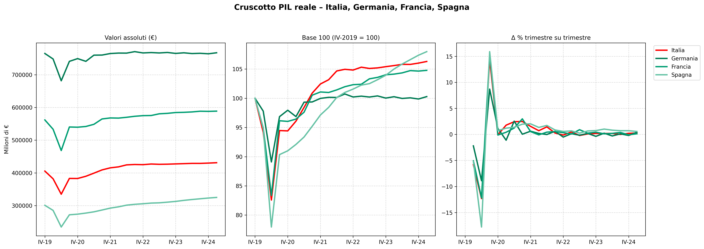

# PIL for dummies


**Eurostat** mette a disposizione oltre **10.000 dataset** che raccolgono informazioni statistiche sui 27 Paesi dell’Unione Europea.  
Ogni dataset è una struttura complessa, organizzata in più dimensioni (territorio, tempo, unità di misura, variabili economiche, ecc.).

Prendiamo ad esempio il **PIL** (GDP): uno dei dataset principali è **`namq_10_gdp`**, che contiene i dati trimestrali sul prodotto interno lordo.

Il formato standard per questi dati è **SDMX**, una struttura formale e articolata pensata per lo scambio tra istituzioni.  
Per un uso pratico (es. in CSV, Excel o database), Eurostat fornisce anche una versione **JSON-stat**, più semplice da elaborare ma comunque non immediata: richiede parsing e trasformazioni per ottenere tabelle leggibili.

Scaricare l’intero dataset è quasi sempre **inutile e inefficiente**: ad esempio, `namq_10_gdp` contiene oltre **3 milioni di combinazioni** (tutti i Paesi, tutte le variabili, tutti i trimestri).

Fortunatamente, Eurostat offre un’**API flessibile**, che consente di estrarre solo il subset di dati desiderato gestendo oppurtunamente le **dimensioni**.  
Con una semplice richiesta (GET), si possono ottenere ad esempio solo i dati relativi alla voce **P7** (consumi finali) per **Italia** e **Germania**.

L’unica dimensione che **non può essere filtrata a monte** è il tempo (`time`): tutti i periodi disponibili verranno restituiti.

Per esempio: se voglio 

- `dataset=namq_10_gdp`
- `geo=IT+DE+FR+ES`
- `unit= 'CLV10_MEUR' ,'CLV_I15', 'PD15_EUR', 'CP_MEUR', 'PD_PCH_PRE_EUR',  'PD_PCH_SM_EUR'
- `s_adj=SCA` (dati destagionalizzati e corretti per calendario)
- `na_item= le principali voci di spesa e aggregati macro 'B1G', 'B1GQ', 'P3', 'P51G', 'P6', 'P7', 'B11', 'P52', 'P53'
- `format=JSON` (per lettura diretta o parsing automatico con Python/Pandas)

il **link completo** per scaricare con un browser i dati in formato JSON-stat da Eurostat, secondo i filtri indicati:
`https://ec.europa.eu/eurostat/api/dissemination/statistics/1.0/data/namq_10_gdp?geo=IT+DE+FR+ES&unit=CLV10_MEUR+CLV_I15+PD15_EUR+CP_MEUR+PD_PCH_PRE_EUR+PD_PCH_SM_EUR&s_adj=SCA&na_item=B1G+B1GQ+P3+P51G+P6+P7+B11+P52+P53&format=JSON`


Con  Python
```python
df = fetch_eurostat_data(
    dataset='namq_10_gdp',
    filters={
   'geo': ['IT', 'DE', 'FR', 'ES'],
   'unit': ['CLV10_MEUR', 'CLV_I15', 'PD15_EUR',CP_MEUR', 'PD_PCH_PRE_EUR', 'PD_PCH_SM_EUR'],
   's_adj': 'SCA',
   'na_item': ['B1G', 'B1GQ', 'P3', 'P51G', 'P6','P7', 'B11', 'P52', 'P53']
    }
)
```

Per lavorare con questi dati in Python, è consigliabile:

- convertirli in DataFrame con una funzione di parsing personalizzata 
- oppure usare librerie compatibili con JSON-stat, come [`pyjstat`](https://pypi.org/project/pyjstat/).




## namq_10_gdp

Eurostat contiene oltre **9.300 dataset**; 'elenco completo è [qui](https://ec.europa.eu/eurostat/api/dissemination/catalogue/toc/txt?lang=en))

namq_10_gdp è uno dei **90 dataset** che trattano di PIL/GDP; gli altri: 

bop_fdi6_ind, bop_gdp6_q, cei_pc032, dsb_sprex01, educ_figdp, educ_uoe_fine06, ei_na_q_vtg, ei_namq_10_bbr, ei_namq_10_ma, enpe_hlth_exp, enpe_nama_10_lp, enpe_nama_gdp, enpe_spr_exp, enps_nama_10_pc, enps_nama_gdp, enps_nama_gdp_ext, env_ac_exp2, med_ec4, met_10r_3gdp, met_10r_3pgdp, naida_10_gdp, naidq_10_gdp, 

nama_10_gdp, nama_10_ma, nama_10_pc, nama_10r_2gdp, nama_10r_2gvagr, nama_10r_3gdp, nama_10r_3popgdp, **namq_10_gdp**, namq_10_ma, namq_10_pc, 

prc_rem_gdp, sdg_08_10, sdg_08_11, sdg_10_10, tec00105, tec00106, tec00114, tec00115, teibp051, teina110, tet00003, tet00004, tgs00037, tipsbp100, tipsbp11, tipsbp12, tipsbp13, tipsbp41, tipsbp42, tipsbp43, tipsbp51, tipsbp53, tipsbp90, tipsen10, tipsfs11, tipsfs13, tipsfs31, tipsfs33, tipsgd, tipsii20, tipsii30, tipsii40, tipsii50, tipsna10, tipsna15, tipsna40, tipsna50, tipspc13, tipspc15, tipspc20, tipspc23, tipspc25, tipspd13, tipspd15, tipspd20, tipspd23, tipspd25, tipspd30, tps00098, tps00103, tps00108, tran, tran_hv, tran_hv_frtra, tran_hv_pstra, ttr00001, urt_10r_3gdp, urt_10r_3pgdp

| code                                           | title                                                                                                                      |
| ---------------------------------------------- | -------------------------------------------------------------------------------------------------------------------------- |
| bop_fdi6_ind                                   | EU direct investments indicators in % of GDP, impact indicators and rate of return on direct investment (BPM6)             |
| bop_gdp6_q                                     | Main Balance of Payments and International Investment Position items as share of GDP (BPM6)                                |
| cei_pc032                                      | Generation of waste excluding major mineral wastes per GDP unit                                                            |
| dsb_sprex01                                    | Social protection expenditure on disability by benefits - % of GDP                                                         |
| educ_figdp                                     | Expenditure on education as % of GDP or public expenditure                                                                 |
| educ_uoe_fine06                                | Public expenditure on education by education level and programme orientation - as % of GDP                                 |
| ei_na_q_vtg                                    | Gross domestic product (GDP) - quarterly  data - vintages based on ESA 2010                                                |
| ei_namq_10_bbr                                 | Basic breakdowns of main GDP aggregates and employment (by industry and assets)                                            |
| ei_namq_10_ma                                  | Main GDP aggregates                                                                                                        |
| enpe_hlth_exp                                  | Health care expenditure - % of GDP, ENP-East countries                                                                     |
| enpe_nama_10_lp                                | Labour productivity in GDP (constant prices) per person employed, ENP-East countries                                       |
| enpe_nama_gdp                                  | GDP, main aggregates and economic indicators                                                                               |
| enpe_spr_exp                                   | Social protection expenditure excluding administrative costs (including health expenditure) - % of GDP, ENP-East countries |
| enps_nama_10_pc                                | Gross domestic product (GDP) per capita - ENP-South countries                                                              |
| enps_nama_gdp                                  | GDP, main aggregates and economic indicators                                                                               |
| enps_nama_gdp_ext                              | External balance of goods and services - % per GDP, ENP-South countries                                                    |
| env_ac_exp2                                    | Environmental protection expenditure - euro per inhabitant and % of GDP (1996-2013)                                        |
| med_ec4                                        | International trade as a share of GDP                                                                                      |
| met_10r_3gdp                                   | Gross domestic product (GDP) at current market prices by metropolitan region                                               |
| met_10r_3pgdp                                  | Average annual population to calculate regional GDP data by metropolitan region                                            |
| naida_10_gdp                                   | GDP and main aggregates - international data cooperation annual data                                                       |
| naidq_10_gdp                                   | GDP and main aggregates - international data cooperation quarterly data                                                    |
| nama_10_gdp                                    | Gross domestic product (GDP) and main components (output, expenditure and income)                                          |
| nama_10_ma                                     | GDP and components                                                                                                         |
| nama_10_pc                                     | Gross domestic product (GDP) and main components per capita                                                                |
| nama_10r_2gdp                                  | Gross domestic product (GDP) at current market prices by NUTS 2 region                                                     |
| nama_10r_2gvagr                                | Gross domestic product (GDP) and Gross value added (GVA) in volume by NUTS 2 region                                        |
| nama_10r_3gdp                                  | Gross domestic product (GDP) at current market prices by NUTS 3 region                                                     |
| nama_10r_3popgdp                               | Average annual population to calculate regional GDP data (thousand persons) by NUTS 3 region                               |
| <span class="highlight-red">namq_10_gdp</span> | Gross domestic product (GDP) and main components (output, expenditure and income)                                          |
| namq_10_ma                                     | GDP and components                                                                                                         |
| namq_10_pc                                     | Gross domestic product (GDP) and main components per capita                                                                |
| prc_rem_gdp                                    | GDP weights used in the calculation of the global specific indicator                                                       |
| sdg_08_10                                      | Real GDP per capita                                                                                                        |
| sdg_08_11                                      | Investment share of GDP by institutional sectors                                                                           |
| sdg_10_10                                      | Purchasing power adjusted GDP per capita                                                                                   |
| tec00105                                       | Inward FDI stocks in % of GDP                                                                                              |
| tec00106                                       | Outward FDI stocks in % of GDP                                                                                             |
| tec00114                                       | GDP per capita in PPS                                                                                                      |
| tec00115                                       | Real GDP growth rate - volume                                                                                              |
| teibp051                                       | Balance of payments, current account, quarterly data - % of GDP                                                            |
| teina110                                       | GDP deflator                                                                                                               |
| tet00003                                       | Exports of goods and services in % of GDP                                                                                  |
| tet00004                                       | Imports of goods and services in % of GDP                                                                                  |
| tgs00037                                       | Gross domestic product (GDP) and Gross value added (GVA) in volume by NUTS 2 region                                        |
| tipsbp100                                      | Direct investment liabilities (stocks) - annual data, % of GDP                                                             |
| tipsbp11                                       | Current account, main components, net balance - annual data, % of GDP                                                      |
| tipsbp12                                       | Current account, main component, credit - annual data, % of GDP                                                            |
| tipsbp13                                       | Current account, main components, debit - annual data, % of GDP                                                            |
| tipsbp41                                       | Current account, main components, net balance - quarterly data, % of GDP                                                   |
| tipsbp42                                       | Current account, main components, credit - quarterly data, % of GDP                                                        |
| tipsbp43                                       | Current account, main components, debit - quarterly data, % of GDP                                                         |
| tipsbp51                                       | Direct investment in the reporting economy - quarterly data, % of GDP                                                      |
| tipsbp53                                       | Direct investment abroad - quarterly data, % of GDP                                                                        |
| tipsbp90                                       | Direct investment liabilities (flows) - annual data, % of GDP                                                              |
| tipsen10                                       | Net trade balance of energy products - % of GDP                                                                            |
| tipsfs11                                       | Total financial sector liabilities, by sub-sectors, non-consolidated - % of GDP                                            |
| tipsfs13                                       | Total financial sector liabilities, by instruments, non-consolidated - % of GDP                                            |
| tipsfs31                                       | Total financial sector liabilities, by sub-sectors, consolidated - % of GDP                                                |
| tipsfs33                                       | Total financial sector liabilities, by instruments, consolidated - % of GDP                                                |
| tipsgd                                         | Gross domestic product (GDP)                                                                                               |
| tipsii20                                       | Net external debt - annual data, % of GDP                                                                                  |
| tipsii30                                       | Net external debt - quarterly data, % of GDP                                                                               |
| tipsii40                                       | Net international investment position - quarterly data, % of GDP                                                           |
| tipsii50                                       | Net international investment position excluding non-defaultable instruments - % of GDP                                     |
| tipsna10                                       | Gross domestic product (GDP) at market prices - annual data                                                                |
| tipsna15                                       | Gross domestic product (GDP) at market prices - quarterly data                                                             |
| tipsna40                                       | Real GDP per capita                                                                                                        |
| tipsna50                                       | Residential construction - annual data, % of GDP                                                                           |
| tipspc13                                       | Private sector credit flow: debt securities by sectors, non-consolidated - % of GDP                                        |
| tipspc15                                       | Private sector credit flow: loans by sectors, non-consolidated - % of GDP                                                  |
| tipspc20                                       | Private sector credit flow, consolidated - % GDP                                                                           |
| tipspc23                                       | Private sector credit flow: debt securities by sectors, consolidated - % of GDP                                            |
| tipspc25                                       | Private sector credit flow: loans by sectors, consolidated - % of GDP                                                      |
| tipspd13                                       | Private sector debt: debt securities by sectors, non-consolidated - % of GDP                                               |
| tipspd15                                       | Private sector debt: loans, by sectors, non-consolidated - % of GDP                                                        |
| tipspd20                                       | Private sector debt, consolidated - % of GDP                                                                               |
| tipspd23                                       | Private sector debt: debt securities, by sectors, consolidated - % of GDP                                                  |
| tipspd25                                       | Private sector debt: loans, by sectors, consolidated - % of GDP                                                            |
| tipspd30                                       | Non-financial corporations debt, consolidated - % of GDP                                                                   |
| tps00098                                       | Expenditure on social protection as percentage of GDP                                                                      |
| tps00103                                       | Expenditure on pensions as percentage of GDP                                                                               |
| tps00108                                       | Social protection receipts by type as percentage of GDP                                                                    |
| tran                                           | Modal split, intermodal transport and transport performance relative to GDP                                                |
| tran_hv                                        | Index of inland transport performance per GDP unit                                                                         |
| tran_hv_frtra                                  | Volume of freight transport relative to GDP                                                                                |
| tran_hv_pstra                                  | Volume of passenger transport relative to GDP                                                                              |
| ttr00001                                       | Volume of passenger transport relative to GDP                                                                              |
| urt_10r_3gdp                                   | Gross domestic product (GDP) at current market prices by other typologies                                                  |
| urt_10r_3pgdp                                  | Average annual population to calculate regional GDP data by other typologies                                               |

### Dimensioni di namq_10_gdp

- **freq** Q: Quarterly
- **unit** CLV10_MEUR: Chain linked volumes (2010), million euro
- **s_adj** Seasonally and calendar adjusted data
- **geo** (41 items): 
	- 'European Union - 27 countries (from 2020)', 
	- 'Euro area (EA11-1999, EA12-2001, EA13-2007, EA15-2008, EA16-2009, EA17-2011, EA18-2014, EA19-2015, EA20-2023)', 
	- 'Euro area – 20 countries (from 2023)', 
	- 'Euro area - 19 countries (2015-2022)', 
	- 'Euro area - 12 countries (2001-2006)', 
	- 'Belgium', 	- 'Bulgaria',
	- 'Czechia', 	- 'Denmark',	- 'Germany',	- 'Estonia',	- 'Ireland', 
	- 'Greece', 	- 'Spain',	- 'France', 	- 'Croatia',
	- '**Italy**', 
	- 'Cyprus',	- 'Latvia',	- 'Lithuania', 	- 'Luxembourg', 	- 'Hungary',	- 'Malta',
	- 'Netherlands',	- 'Austria', 	- 'Poland',	- 'Portugal',	- 'Romania', 
	- 'Slovenia',	- 'Slovakia', 	- 'Finland', 	- 'Sweden', 	- 'Iceland', 
	- 'Norway', 	- 'Switzerland', 	- 'United Kingdom', 	- 'Montenegro', 
	- 'North Macedonia',	- 'Albania', 	- 'Serbia', '	- Türkiye'
- **na_items** (39 items):
	- B11: External balance of goods and services
	- B111: External balance - goods
	- B112: External balance - services
	- **B1G: Value added, gross**
	- B1GQ: Gross domestic product at market prices
	- B2A3G: Operating surplus and mixed income, gross
	- D1: Compensation of employees
	- D11: Wages and salaries
	- D12: Employers' social contributions
	- D2: Taxes on production and imports
	- D21: Taxes on products
	- D21X31: Taxes less subsidies on products
	- D2X3: Taxes on production and imports less subsidies
	- D3: Subsidies
	- D31: Subsidies on products
	- P3: Final consumption expenditure
	- P31_S13: Individual consumption expenditure of general government
	- P31_S14: Final consumption expenditure of households
	- P31_S14_S15: Household and NPISH final consumption expenditure
	- P31_S15: Final consumption expenditure of NPISH
	- P32_S13: Collective consumption expenditure of general government
	- P3_P5: Final consumption expenditure and gross capital formation
	- P3_P6: Final consumption expenditure, gross capital formation and exports of goods and services
	- P3_S13: Final consumption expenditure of general government
	- P41: Actual individual consumption
	- P51G: Gross fixed capital formation
	- P52: Changes in inventories
	- P52_P53: Changes in inventories and acquisitions less disposals of valuables
	- P53: Acquisitions less disposals of valuables
	- P5G: Gross capital formation
	- P6: Exports of goods and services
	- P61: Exports of goods
	- P62: Exports of services
	- P7: Imports of goods and services
	- P71: Imports of goods
	- P72: Imports of services
	- YA0: Statistical discrepancy (expenditure approach)
	- YA1: Statistical discrepancy (production approach)
	- YA2: Statistical discrepancy (income approach)


Alcune **aggregazioni territoriali Eurostat** sono molto comuni nei dataset economici:

|Codice geo|Nome esteso|Descrizione sintetica|
|---|---|---|
|**EU27_2020**|European Union – 27 countries (from 2020)|UE a 27 dopo Brexit|
|**EA11**|Euro area (EA11-1999)|Eurozona originaria al 1999|
|**EA12**|Euro area – 12 countries (2001)|Include Grecia|
|**EA13–EA20**|Euro area espansa|Include i paesi entrati fino a EA20 (2023)|
|**EA19**|Euro area – 19 countries (2015–2022)|Usata prima dell'ingresso della Croazia|
|**EA20**|Euro area – 20 countries (from 2023)|Include Croazia|

- Se il grafico parte dal 1995, usare **EA11**, **EA12** o **EA19** per **consistenza storica**
- Se interessa **l’attuale configurazione**,  **EA20** o **EU27_2020**
- Può avere senso affiancare:
    - `Germany`, `France`, `Italy`, `Spain`   
    - `EA20`, `EU27_2020`
    

`na_item` contiene **39 voci**, ciascuna rappresentante un **aggregato contabile nazionale** secondo il sistema ESA 2010 (European System of Accounts):

Tra queste, la voce più comunemente usata per rappresentare il **PIL** è: `B1GQ` – _Gross Domestic Product at market prices_  
B1GQ è il PIL nella sua definizione ufficiale secondo l'ESA 2010  
È il risultato dell'identità contabile:
    
    ```
    PIL = Consumi finali + Investimenti + (Esportazioni - Importazioni)
        = Valore aggiunto lordo + Imposte sui prodotti - Sussidi sui prodotti
    ```
    
È la voce sintetica più rappresentativa per confronti internazionali e temporali.

Le voci `na_item` più comunemente utilizzate nei grafici e nelle analisi macroeconomiche (oltre a `B1GQ`) sono quelle che compongono o spiegano le principali **identità contabili** della contabilità nazionale: **produzione, reddito, spesa**. 
Ecco una selezione delle più rilevanti e frequentemente utilizzate:

### **Contabilità della produzione**

|Codice|Descrizione|Uso comune|
|---|---|---|
|`B1GQ`|Gross domestic product at market prices (PIL)|Principale misura dell’attività economica|
|`B1G`|Value added, gross|Valore aggiunto lordo (PIL a prezzi base)|
|`D2`|Taxes on production and imports|Per ricostruire il passaggio da VA a PIL|
|`D3`|Subsidies|Idem, con segno opposto alle imposte|

### **Contabilità della spesa (domanda aggregata)**

|Codice|Descrizione|Uso comune|
|---|---|---|
|`P3`|Final consumption expenditure|Consumi totali|
|`P31S14`|Final consumption expenditure of households|Consumi privati|
|`P31S13`|Final consumption expenditure of general government|Consumi pubblici|
|`P5G`|Gross capital formation|Investimenti|
|`P6`|Exports of goods and services|Esportazioni|
|`P7`|Imports of goods and services|Importazioni|

### **Contabilità del reddito**

|Codice|Descrizione|Uso comune|
|---|---|---|
|`D1`|Compensation of employees|Occupazione e redditi|
|`D11`|Wages and salaries|Salari|
|`D12`|Employers' social contributions|Contributi sociali|
|`B2A3G`|Gross operating surplus and mixed income|Profitti lordi (imprese e autonomi)|
|`B5G`|Gross national income|Reddito nazionale lordo|
|`B6G`|Gross disposable income|Reddito disponibile lordo|


Se servono per **analisi più dettagliate** del PIL o della contabilità nazionale si possono usare:

|Codice|Descrizione sintetica|Uso tipico|
|---|---|---|
|**B1G**|Valore aggiunto lordo a prezzi base|Analisi produttività|
|**D1**|Retribuzioni dei dipendenti|Mercato del lavoro|
|**P3**|Spesa per consumi finali|Consumi privati e pubblici|
|**P5G**|Formazione lorda di capitale (investimenti)|Cicli economici|
|**P6**|Esportazioni di beni e servizi|Commercio estero|
|**P7**|Importazioni di beni e servizi|Commercio estero|
|**B9**|Saldo economico netto (risparmio nazionale)|Risparmio/investimenti|
|**B2A3G**|Risultato operativo lordo (gross operating surplus)|Profitti imprese|

- **Analisi settoriale o funzionale**: per esempio, confrontare `P3` (consumi) e `P5G` (investimenti).
- **Studio della domanda aggregata**: `P3 + P5G + (P6 - P7)` deve uguagliare `B1GQ`.
- **Analisi del reddito primario**: `D1`, `B2A3G`, ecc.
- **Per derivare il PIL via produzione, spesa o reddito**, si usano combinazioni specifiche di `na_item`.

### In sintesi

|Tipo Analisi|Voci chiave|
|---|---|
|PIL aggregato|`B1GQ`|
|Pil lato offerta|`B1G`, `D2`, `D3`|
|Pil lato spesa|`P3`, `P5G`, `P6`, `P7`|
|Pil lato reddito|`D1`, `B2A3G`, `B5G`, `B6G`|
|Famiglie|`P31S14`, `D11`, `B6G`|
|Governo|`P31S13`, `D12`, `D2`, `D5`|


### Risorse utili

- [Eurostat Metadata - ESA 2010 aggregates](https://ec.europa.eu/eurostat/cache/metadata/en/nama_10_gdp_esms.htm)
- [Manuale ESA 2010](https://ec.europa.eu/eurostat/documents/3859598/5925693/KS-02-13-269-EN.PDF)

